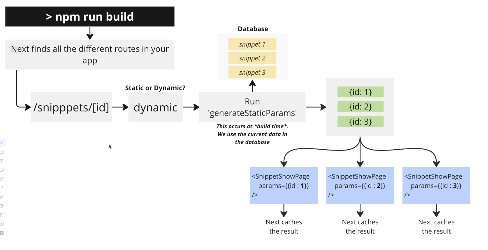

# Caching dynamic route

Not only static routes can be cached. You can cache dynamic routes as well. This is useful when you have a dynamic route that is expensive to render and doesn't change often.

**Basic concept diagram:**




**Example:**

```bash
mattc@x ~/r/snippets (main)> tree src/
src/
├── actions
│   └── index.tsx
└── app
    ├── page.tsx
    └── snippets
        ├── [id]
        │   ├── edit
        │   │   └── page.tsx
        │   └── page.tsx      # This is dynamic route because it has dynamic folder [id] as props, how to cache this?
        └── new
            └── page.tsx

```

```tsx
// src/app/snippets/\[id\]/page.tsx
interface SnippetShowPageProps { params: { id: string; } }  // `id` comes from dynamic folder, which makes this page dynamic

export default async function SnippetShowPage(props: SnippetShowPageProps) {
  // main logic here ...
}

// we export async function `generateStaticParams` to tell Next.js to cache this dynamic route
export async function generateStaticParams() {
  const snippets = await db.snippet.findMany();
  return snippets.map(snippet => ({  // this function need to return array of values for `id`, which is dynamic folder
    id: snippet.id.toString() // `id` is folder name actually, so its value should be string
  }));
}

```

```bash
mattc@x ~/r/snippets (main)> npm run build

...

Route (app)                              Size     First Load JS
┌ ○ /                                    178 B          94.1 kB
├ ○ /_not-found                          875 B            88 kB
├ ● /snippets/[id]                       178 B          94.1 kB    # This dynamic route is cached
├   ├ /snippets/3                                                  # When user request, it will be served from cached HTML
├   └ /snippets/6                                                  # Now this route is cached, so it may render old data, you may need to fix it as well.
├ ƒ /snippets/[id]/edit                  4.7 kB         91.8 kB
└ ○ /snippets/new                        767 B          87.9 kB

○  (Static)   prerendered as static content
●  (SSG)      prerendered as static HTML (uses getStaticProps)
ƒ  (Dynamic)  server-rendered on demand

```


**If I add new snippets, do I need to rebuild to cache new dynamic route?**

No, you don't need to rebuild. Next.js will automatically render a cached HTML for the new snippet when you create it. BUT It takes time to render the first time, so if creating new snippet is frequent, you may want to use `ISR` instead of caching.

**Cached dynamic route may render old data, how to fix it?**

Same as static route, there are some [[2024-10-15_Help!-My-next-page-is-rendering-with-out-of-date-data!|options]].

