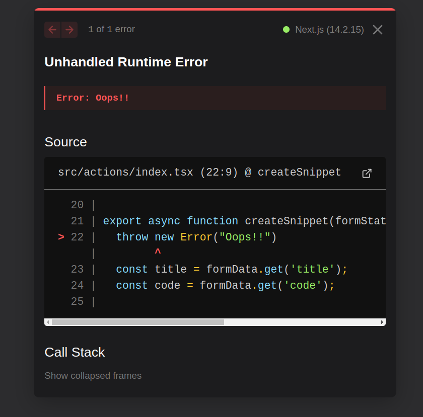

# If Server action throw an error

```tsx
'use server';

export async function serverAction() {
  // Possible unexpected errors may occur when querying the database or requesting external APIs.
  throw new Error('This is an error');  // assume this is an unexpected error
}

```

The user will see an error page like this:



Usually we do not want users to see such error messages, there are two ways to handle this issue:

1. Use [[2024-10-13_Special-file-name-under-the-app-directory|special file]] - [[2024-10-15_Using-special-file-to-handle-the-error|error.tsx]]
2. Catch the error in the server action and return error message [[2024-10-15_Handling-server-action-error-by-useFormState-mechanism|with useFormState mechanism]].
```tsx
