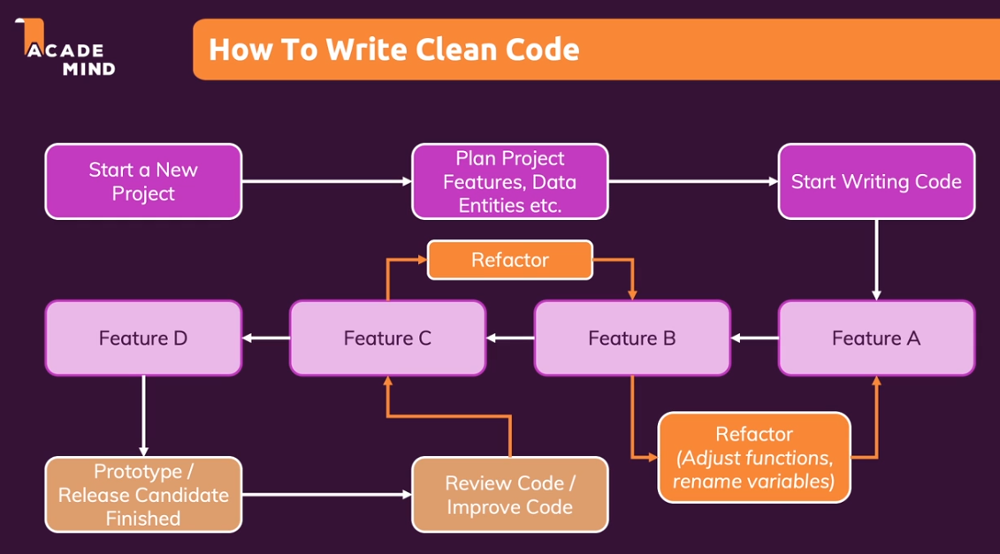
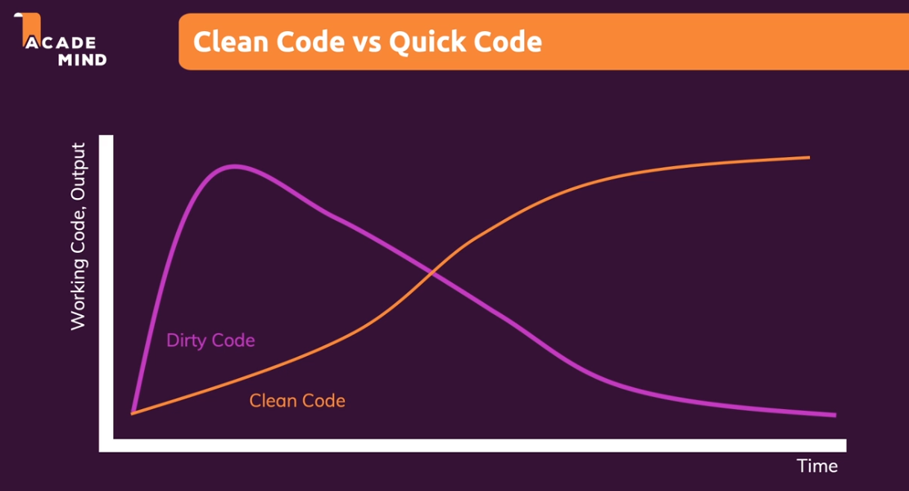

# Clean Code or Quick Code

**We should do lots of refactors when adding new features or debugging.**

**Embrace Refactoring!**

- Refactoring today is work you save tomorrow

- A codebase can only survive and stay maintainable if it's continuously improved and refactored

- Pro tip: Whenever you add something new, try to improve existing code along the way

**Refactoring save team's future time**

Although engineers are under time pressure, refactoring is a very important task. This can make future development faster, more efficient, and less error-prone.

If blindly developing quickly, the future maintenance cost will be higher, it will also be more prone to errors, and may even make the entire project impossible to maintain.

