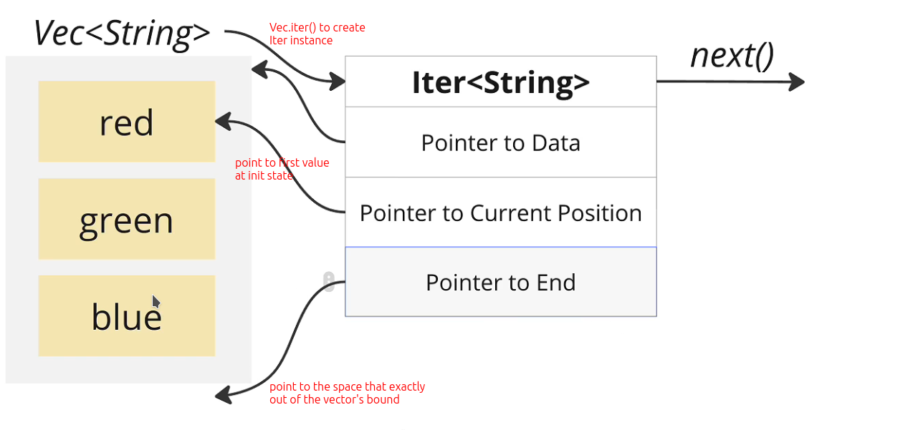
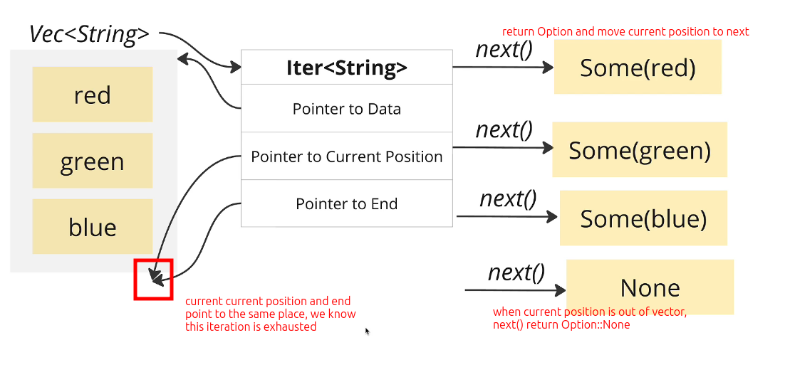

# Create Iter from a vector and iterate it manually

```rust
fn main() {
    let colors = vec![
        String::from("Red"),
        String::from("Green"),
        String::from("Blue"),
    ];

    let mut colors_iter = colors.iter();
  //                            ^^^^^^^ create an Iter type value from the vector
  //                                    It is total separate from the vector

    println!("{:#?}", colors_iter.next());
    //                           ^^^^^^^ Iter has a method `next` for us to get current pointer position value and move pointer to next value
    //                                   It return Some(value) if current pointer is pointing to a value
    println!("{:#?}", colors_iter.next());
    println!("{:#?}", colors_iter.next());
    println!("{:#?}", colors_iter.next());
    //                           ^^^^^^^ It return None if current pointer is pointing to None, and iterator is exhausted
}

```

```bash
~/D/g/s/r/iter > cargo run -q
Some("Red")
Some("Green")
Some("Blue")
None

```

Below we will visualize the codes above:




