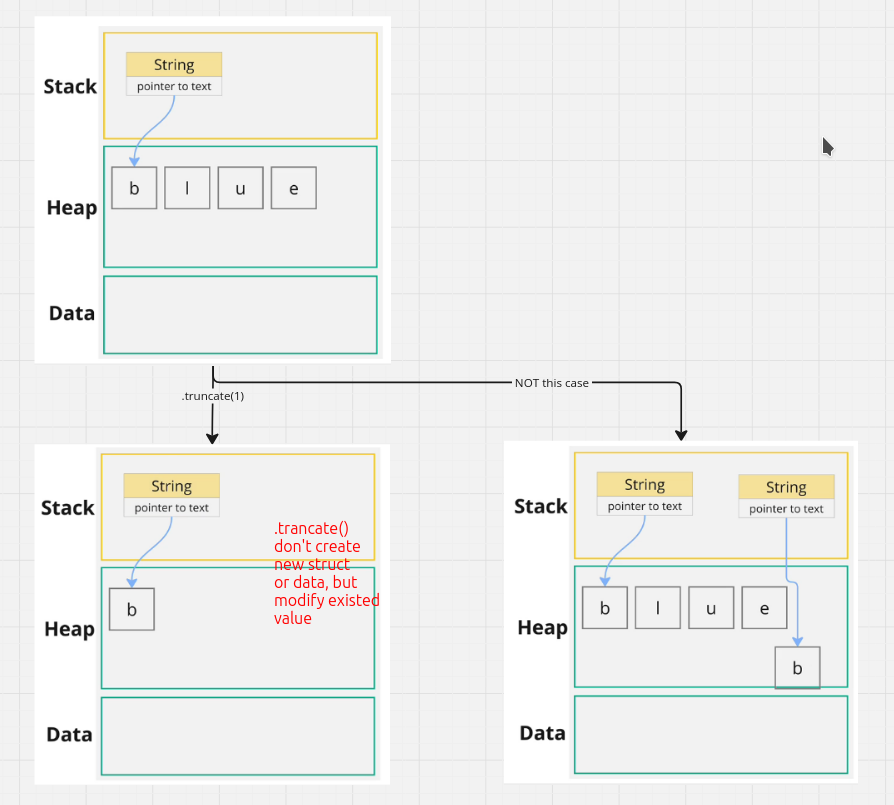

# String truncate

`.truncate()` is a method of the `String` struct to truncate a string to a given length **IN PACE**, which means it won't create a new String value, but will modify the original one.

```rust
fn main() {
    let mut s = String::from("blue");

    s.truncate(1);
}
```

We visualize it as follows:


