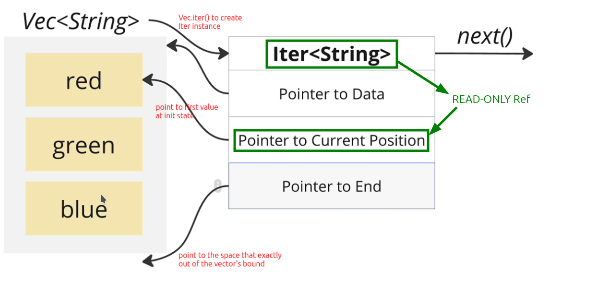

# Three Iterator pointer type


## Iter's pointer to the vector's element is a READ-ONLY reference

From [[2024-11-16_Create-Iter-from-a-vector-and-iterate-it-manually|this topic]], we know that Iter is totally separated from the vector, and it's a pointer to the vector's struct and its element.

But there is still one important thing that has not been mentioned, this pointer pointing to the vector's element is a **READ-ONLY** reference.


It means when we use the Iter consumer or adapter, their closure gets the Iter pointer to vector's element, and they can only read the element, not modify it. Below is the example:

```rust
fn print_elements(elements: &[String]) {
    elements
        .iter()  // Iter type iterator, read-only reference to the vector's element
        .for_each(|el| println!("{}", el));
        //         ^^                 ^^  It means that `el` is a READ-ONLY reference
}

fn main() { ... }
```

In some situations, we really need to change the elements of a vector or even take ownership of these elements. Therefore, Rust provides three types of iterators to meet these needs:

## Three Rust Iterator type

- `iter()` → The iterator will give you a **read-only reference** to each element

- `iter_mut()` → The iterator will give you a **mutable reference** to each element

- `into_iter()` → The iterator gives you **ownership** of each element, *unless called on a mutable ref to a vector (corner case)*

> **NOTE** We will see many methods with the keyword `into`, which strongly implies that this method will take ownership of the value, so when using these methods, be especially careful not to accidentally have your data taken ownership of.
