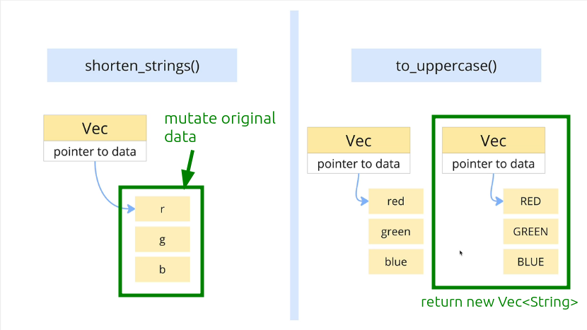

# Create a fn to RETURN uppercase string vector

Compared to the function [[2024-11-17_Create-a-fn-to-shorten-String-of-vector|shorten_strings]], we are now going to write a function `to_uppercase` that does not change the content of the input `vector`, but instead returns a new `vector` where each element is the uppercase form of the corresponding element in the input `vector`.



```rust
fn to_uppercase(elements: &[String]) -> Vec<String> {
//                        ^^^^^^^^^     ^^^^^^^^^^^^^^ type annotation of return to determine what type of data structure of `.collect()` creates
//                            ^
//                            We won't do any mutation to the source data or store it in this case
//                            So set input type as read-only reference 
    
    elements
        .iter()
        .map(|el| el.to_uppercase())
        //          ^^^^^^^^^^^^^^^ This method will return a new String
        .collect()
    //  ^^^^^^^^^^ This is one of the iterator consumer (so it will call .next()),
    //             it will create a new data structure (in this case, Vec<String>)
    //             and collect the results of previous iterator methods
}

fn main() {
    let colors = vec![
        String::from("Red"),
        String::from("Green"),
        String::from("Blue"),
    ];

    let uppercased = to_uppercase(&colors);
    println!("{:#?}", uppercased);
}

```
