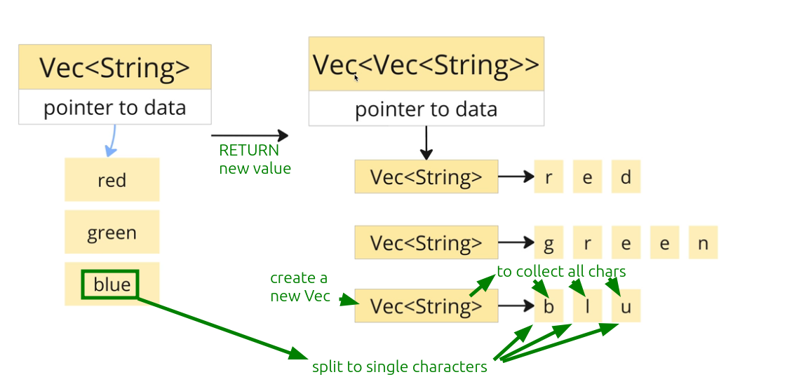
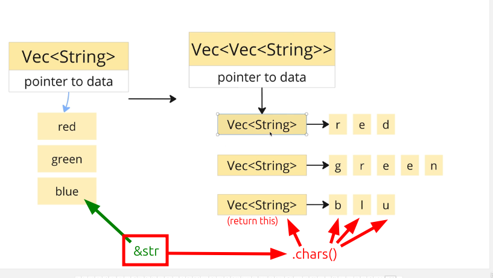

# Create a fn to explode a vector of string

## Requirement




## Solution

```rust
fn explode(elements: &[String]) -> Vec<Vec<String>> {
//                   ^^^^^^^^^  ^^^^^^^^^^^^^^^^^^^ 
//                   we don't mutate original vector
    elements
        .iter()
        .map(|el| el.chars() // .chars() create each character of the string,
                             // and create another iterator pointing to each character and return that iterator

                    .map(|c| c.to_string()) // convert each character to a string to fit our return type String

                    .collect()) // based on return type, it will create a vector of string and collect the results of previous map
                                // here we get Vec<String> for each character of a String

        .collect() // collect Vec<String> of all String, then we get Vec<Vec<String>>, which is our return type
}

fn main() {
    let colors = vec![
        String::from("Red"),
        String::from("Green"),
        String::from("Blue"),
    ];

    println!("{:#?}", explode(&colors));
  //                  ^^^^^^^^^^^^^^^^
}

```

```bash
~/D/g/s/r/iter > cargo run -q
[
    [
        "R",
        "e",
        "d",
    ],
    [
        "G",
        "r",
        "e",
        "e",
        "n",
    ],
    [
        "B",
        "l",
        "u",
        "e",
    ],
]

```

Apart from nested map, I think it is also important to pay attention to the fact that `.chars()` generates character values from &str and an iterator also return it.


