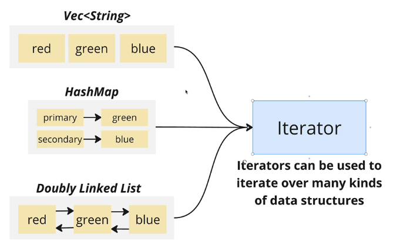
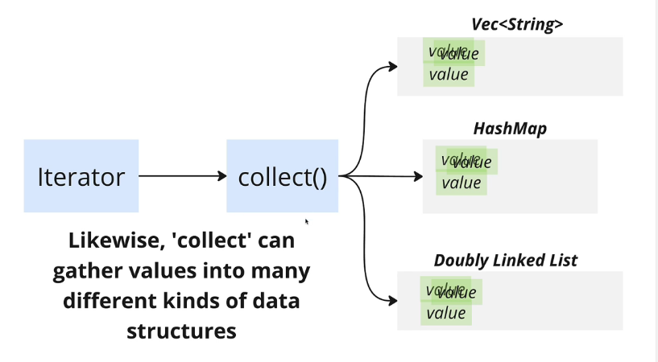

# How iterator collect method to determine what type of data structure to create


## Iterators in Rust support different kinds of data structures




## So does the collect method of it




## There are three way to determine the type of data structure to create when using collect method

Here we use [[2024-11-18_Create-a-fn-to-RETURN-uppercase-string-vector|this example]] to illustrate the three ways:

**1. Using type annotation of fn return type**

```rust
fn to_uppercase(elements: &[String]) -> Vec<String> {
//                        ^^^^^^^^^     ^^^^^^^^^^^^^^ type annotation of return to determine what type of data structure of `.collect()` creates
    
    elements
        .iter()
        .map(|el| el.to_uppercase())
        .collect()
    //  ^^^^^^^^^^ Create a Vec<String> data structure
}

```

**2. Using type annotation of the variable**

```rust
fn to_uppercase(elements: &[String]) -> Vec<String> {
    let result: Vec<String> = elements
    //  ^^^^^^^^^^^^^^^^^^^^ type annotation of variable to determine what type of data structure of `.collect()` creates
        .iter()
        .map(|el| el.to_uppercase())
        .collect();
    //  ^^^^^^^^^^ Create a Vec<String> data structure
    result
}
```

**3. Using turbofish syntax**

```rust
fn to_uppercase(elements: &[String]) -> Vec<String> {
    elements
        .iter()
        .map(|el| el.to_uppercase())
        .collect::<Vec<String>>()
    //          ^^^^^^^^^^^^^^^^^ Create a Vec<String> data structure
}
```
You can omit the turbofish syntax if the compiler can infer the type of the data structure to create.

```rust
fn to_uppercase(elements: &[String]) -> Vec<String> {
    elements
        .iter()
        .map(|el| el.to_uppercase()) // retrun String of each iteration
        .collect::<Vec<_>>()
        //             ^ compiler can infer the type by previous map function return type
        //               so we can omit the turbofish syntax
}
```
