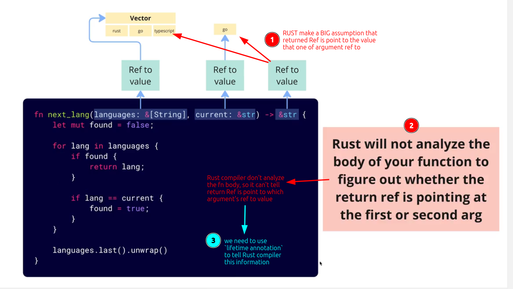

# Big assumption when fn args and return type are all reference

In [[2024-11-19_Create-a-fn-to-get-ref-to-next-lang-of-languages-vector|this case]], arguments and return type of fn `next_language` are all reference, which make RUST compiler do a big assumption:

> The value pointed to by the returned reference must be the value pointed to by a certain argument reference.

And another fact is that:

> Rust compiler do NOT analyze the fn body


Based on the above assumption and fact, one thing will happen that the Rust compiler cannot know:

> Which argument's reference does the value pointed to by the returning reference point to?

So we must use `lifetime annotation` to tell the Rust compiler about that.

I visualize the above assumption and fact as below:



Assuming in the function `next_language`, if we know that the value pointed to by the returned reference is the same as the value pointed to by the argument reference `language`, we must use a `lifetime annotation` to inform the Rust compiler of this fact as follows:

```rust
fn next_language<'a>(language: &'a [String], current: &str) -> &'a str { ... }
//              ^^^^            ^^                              ^^
//         create a type 'a'     ^^^^^^^^^^^^^^^^^^^^^^^^^^^^^^^^
//                                  set first argument Ref and return Ref are type 'a', which means they are point the same value

```

## Corner cases

There are some situations we don't need to add lifetime annotation, [[2024-11-19_Corner-cases-of-lifetime-annotation|this topic]] has detailed information about them. 
