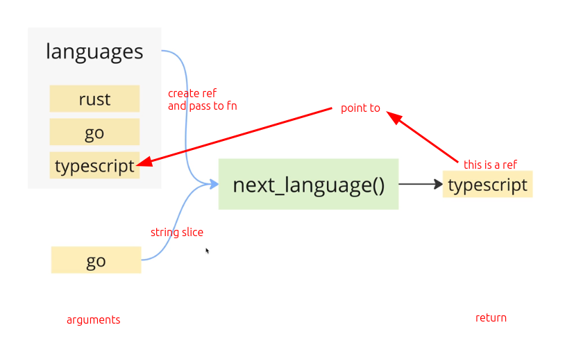

# Create a fn to get ref to next lang of languages vector


## Requirement




## Try to write the code

```rust
fn next_language(languages: &[String], current: &str) -> &str {
//                                                       ^ we got the compiler error here:
//                                                            missing lifetime specifier
//                                                            this function's return type contains a borrowed value,
//                                                            but the signature does not say whether it is borrowed from `languages` or `current`

    let mut found = false;

    for lang in languages {
        if found {
            return lang;
        }
        if lang == current {
            found = true;
        }
    }

    languages.last().unwrap() // assume that source vector always has some elements
                              // for demo purpose
}

fn main() {
    let languages = vec![
        String::from("Rust"),
        String::from("Python"),
        String::from("JavaScript"),
    ];

    let next_language = next_language(&languages, "Python");

    println!("Next language: {}", next_language);
}

```

Above, we found an error in the return type, [[2024-11-19_Big-assumption-when-fn-args-and-return-type-are-all-reference|here]] is detail about that.

We add `lifetime annotation` to fix the error:

```rust
fn next_language<'a>(languages: &'a [String], current: &str) -> &'a str {
//               ^^              ^^                              ^^
//               ^                ^^^^^^^^^^^^^^^^^^^^^^^^^^^^^^^^ set first arg Ref and return Ref are type 'a', which means they are point the same value
//              create a type 'a'
    let mut found = false;

    for lang in languages {
        if found {
            return lang;
        }
        if lang == current {
            found = true;
        }
    }

    languages.last().unwrap()
}

fn main() {
    let languages = vec![
        String::from("Rust"),
        String::from("Python"),
        String::from("JavaScript"),
    ];

    let next_language = next_language(&languages, "Python");

    println!("Next language: {}", next_language);
}
