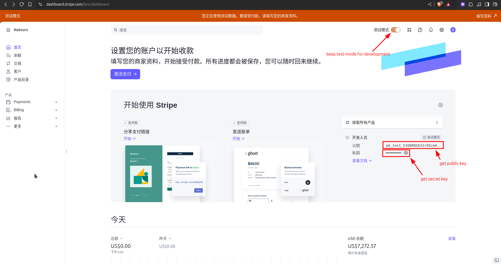
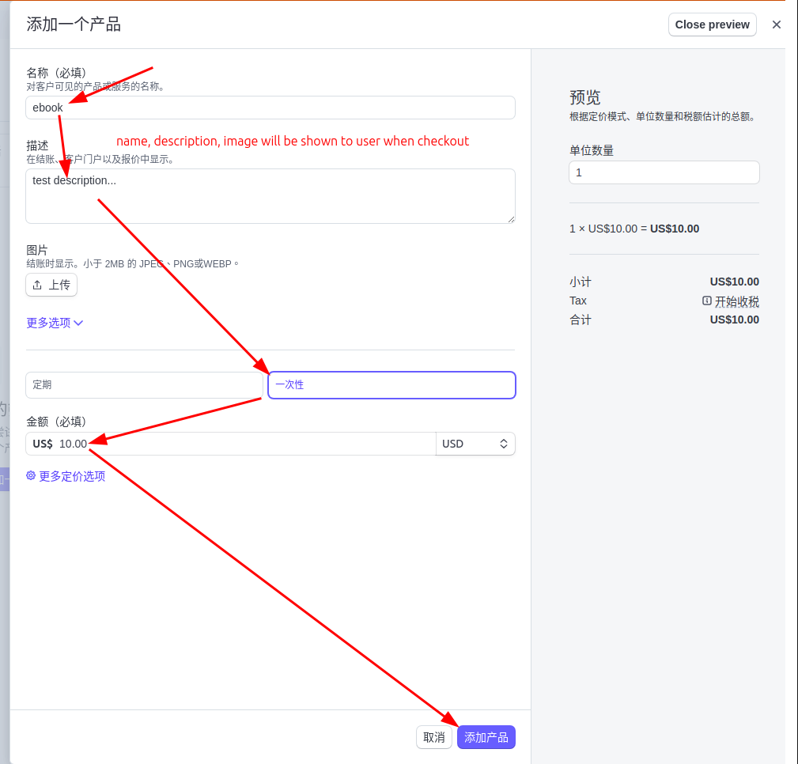
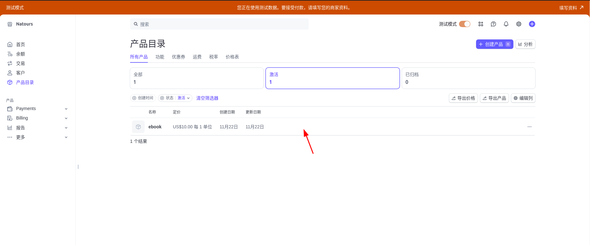
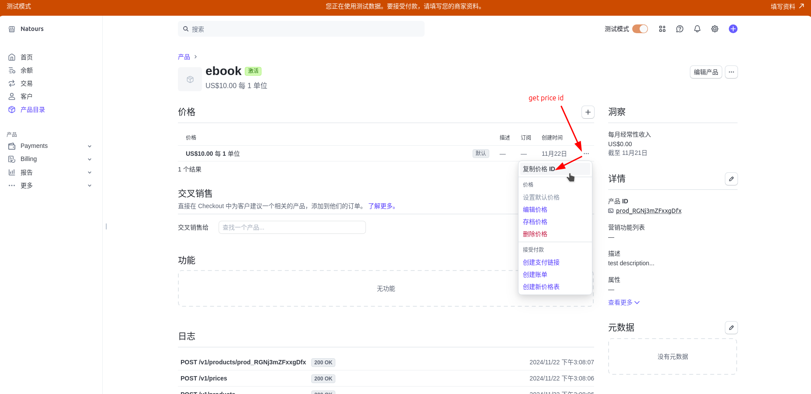

# Prepare for integration with Stripe: Get three values from its website

## Get three values from Stripe website

We need to have an account to log in to Stripe, and then obtain three values according to the following operation process:












## Insert the values into the .env file of our project

```sh
# .env
PUBLIC_STRIPE_KEY=pk_test_51OOKN1DJ2r9ILm4nrekokKkOaLyw21ele60e5ni6y2qfXioNf5b44YMP5FGiVtvEXywwnaPfeqC3CsO1pCE7KfIu00aQfaIf8G
#                 ^^ ^^^^ pk means public key from Stripe and test means only for test mode
STRIPE_API_KEY=sk_test_51OOKN1DJ2r9ILm4n1Bwd5zjOiv48HT12LoFv7Y2fRxVyVYfz68K26r4pcz0FKvzm0Hqqe1STwV66CAK1W8UIhrSM00QQIOdzde
#              ^^ ^^^^ sk means secret key from Stripe and test means only for test mode
PRICE_ID=price_1QNqyIDJ2r9ILm4n1laYZXHh
#        ^^^^^ price means its a price id from Stripe

```

After we got these three values, we can start to implement the Stripe payment process in our project, but most importantly, we need to know the whole flow of [[2024-11-22_Stripe-Integration-flow|Stripe payment process]].
