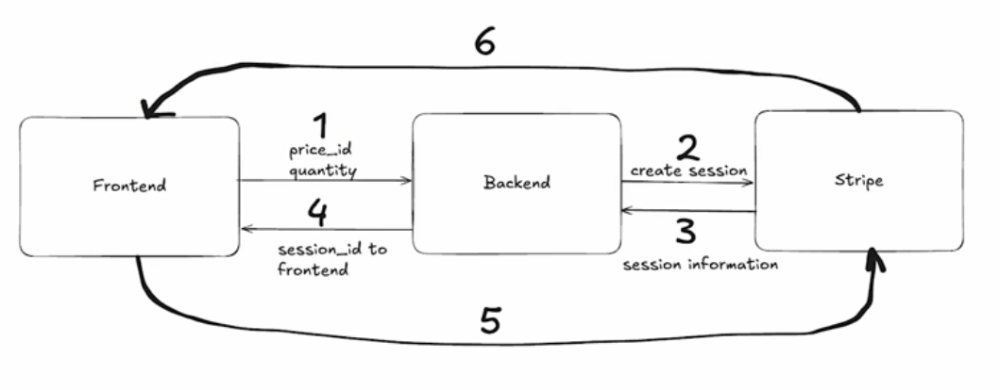

# Stripe Integration flow

## Flow

1. Frontend sends request to our backend with all information about the purchase (e.g. price_id, quantity, etc.), we implement this in [[2024-11-23_Pass-some-payment-informations-from-frontend-to-backend|this topic]].

2. Going to create a checkout session with stripe by using the secret stripe key with all the given purchase information

3. Stripe creates session and gives us all necessary information about the created session. Mainly, we want the ID!

4. Session ID being returned to our Svelte Frontend 

We impelemnt 2~4 steps in [[2024-11-23_Pass-Stripe-session-from-backend-to-Stripe-and-return-session-id-to-frontend|this topic]].

5. Frontend redirects to given session using the stripe frontend library
   * With the sessionId, we also tell stripe where to forward the user depending on success/failure of payment

6. Stripe brings user back to our Svelte page!
   * Depending on cancellation/failure or success of payment, it should forward the user to different pages

We implement 5~6 steps in [[2024-11-23_Redirect-to-Stripe-chechout-page-from-frontend|this topic]].

Because there are many external activities, we need to handle errors well. In [[2024-11-23_Error-handling-for-Stipe-flow|this topic]], we have implemented this part.

## Frontend and Backend libraries

From the above flow, we can see that the Stripe payment process is completed by both the front end and back end, so we need two libraries to complete this process:

**backend:**
[https://www.npmjs.com/package/stripe]

**frontend:**
[https://www.npmjs.com/package/@stripe/stripe-js]

## Success and Failure pages of our project

The flow mentioned above states that we need to redirect users to different pages based on whether the payment is successful or unsuccessful. We have implemented this in [[2024-11-23_Create-success-and-failure-pages-for-Stripe-checkout-results|this topic]].
