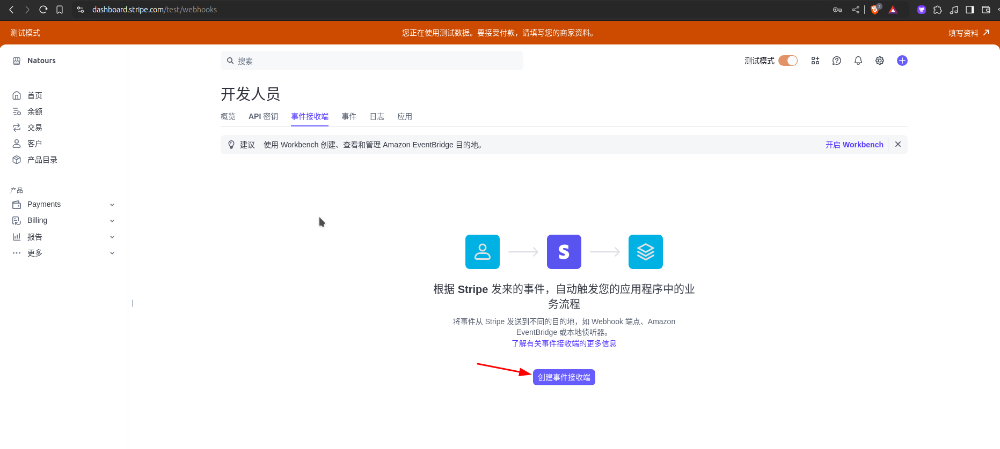
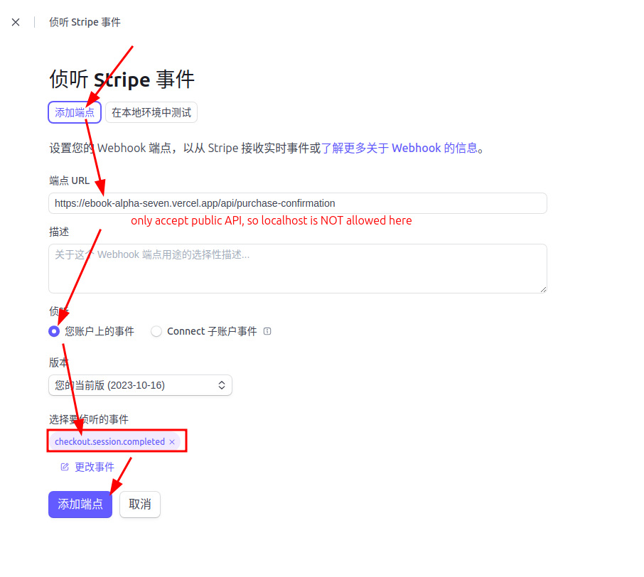

# Create Stipe webhook of session complete to the public API of our project

A webhook is when the Stripe server sends a request to our server's API endpoint, informing us that a session has been completed. Our API endpoint will then respond with the information obtained from the request to the frontend of our project, allowing the frontend to update the UI based on the information from the Stripe server.

We must set up a webhook on the Stripe website as follows:






`/api/purchase-confirmation` is the API endpoint of our project, we create a dummy one for testing purposes as follows:

```ts
// src/routes/api/purchase-confirmation/+server.ts 
import { json, type RequestHandler } from "@sveltejs/kit";

export const POST: RequestHandler = async ({ request }) => {
  const requestBody = await request.json();

  console.log("requestBody", requestBody);  // print to the backend console (terminal)

  return json(requestBody); // return to the frontend
}

```

We will get requestBody as below:

```bash
requestBody {
  id: 'evt_1QOLsFDJ2r9ILm4n3Uf2ydve',
  object: 'event',
  api_version: '2023-10-16',
  created: 1732378075,
  data: {
    object: {
      id: 'cs_test_a1ZuEOhC7GzcZhNzPsdrvpqW9Jxlli3sxi6lYKjxxzPnjSeWQlu98OXApa',
      object: 'checkout.session',
      adaptive_pricing: [Object],
      after_expiration: null,
      allow_promotion_codes: null,
      amount_subtotal: 1000,
      amount_total: 1000,
      automatic_tax: [Object],
      billing_address_collection: null,
      cancel_url: 'http://localhost:5173/checkout/failure',
      client_reference_id: null,
      client_secret: null,
      consent: null,
      consent_collection: null,
      created: 1732378053,
      currency: 'usd',
      currency_conversion: null,
      custom_fields: [],
      custom_text: [Object],
      customer: null,
      customer_creation: 'if_required',
      customer_details: [Object],
      customer_email: null,
      expires_at: 1732464453,
      invoice: null,
      invoice_creation: [Object],
      livemode: false,
      locale: null,
      metadata: {},
      mode: 'payment',
      payment_intent: 'pi_3QOLsEDJ2r9ILm4n0kZkykJa',
      payment_link: null,
      payment_method_collection: 'if_required',
      payment_method_configuration_details: null,
      payment_method_options: [Object],
      payment_method_types: [Array],
      payment_status: 'paid',
      phone_number_collection: [Object],
      recovered_from: null,
      saved_payment_method_options: null,
      setup_intent: null,
      shipping_address_collection: null,
      shipping_cost: null,
      shipping_details: null,
      shipping_options: [],
      status: 'complete',
      submit_type: null,
      subscription: null,
      success_url: 'http://localhost:5173/checkout/success',
      total_details: [Object],
      ui_mode: 'hosted',
      url: null
    }
  },
  livemode: false,
  pending_webhooks: 3,
  request: { id: null, idempotency_key: null },
  type: 'checkout.session.completed'
}
```

If we want to make our localhost server enable to listen to Stripe webhook, we need to install Stripe CLI and use it to forward the webhook to our localhost server, there is detail explanation in [[2024-11-23_Using-Stripe-CLI-to-forward-webhook-to-localhost|this topic]].


