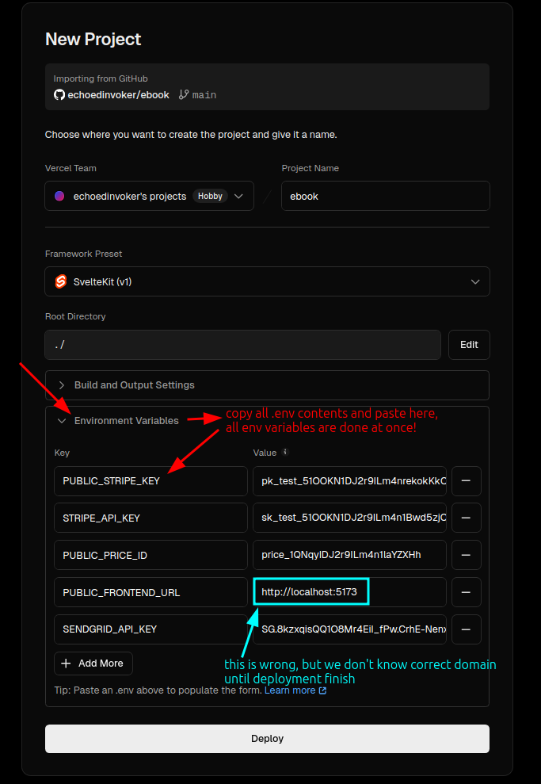
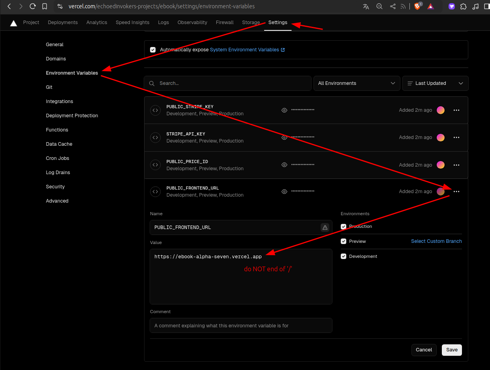
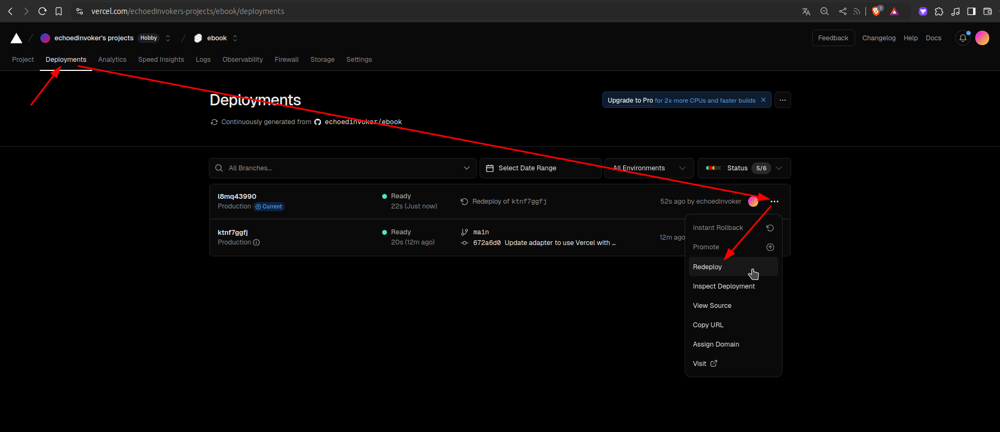
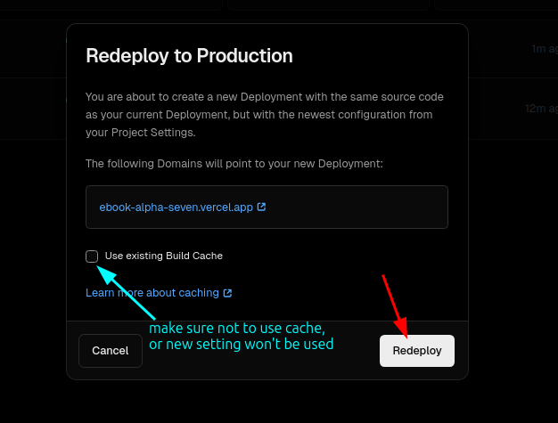

# Deploy to vercel

1. publish the project to GitHub

2. go to vercel.com, then you can just import the project from GitHub

3. copy environment variables from `.env` to vercel deployment settings

4. After deploying done, reset the environment variable of domain to the new one

5. And then, you should re-deploy the project to make new environment variables take effect.

