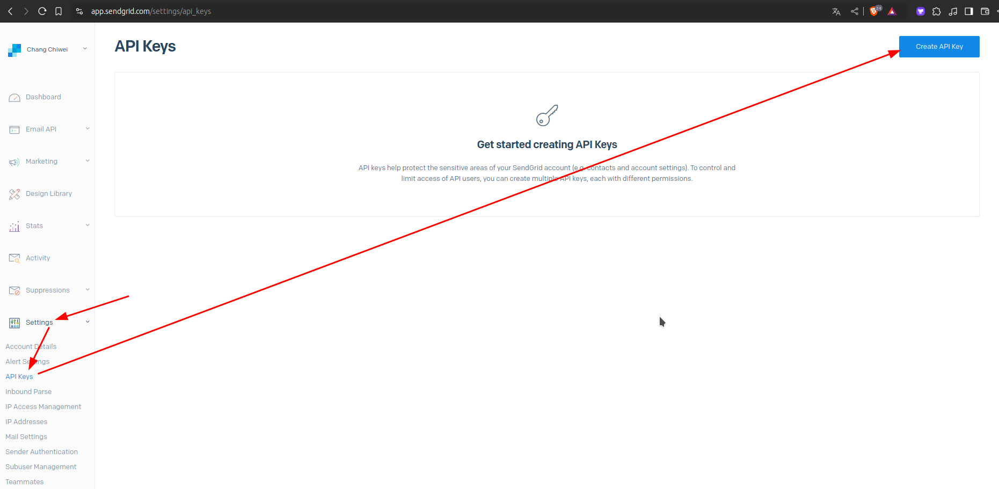
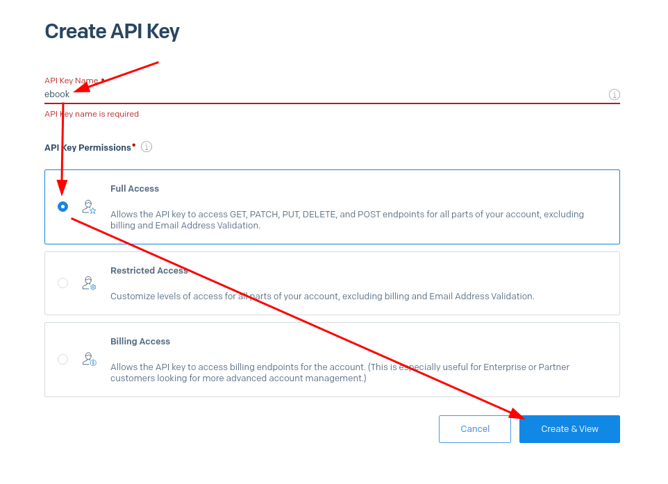
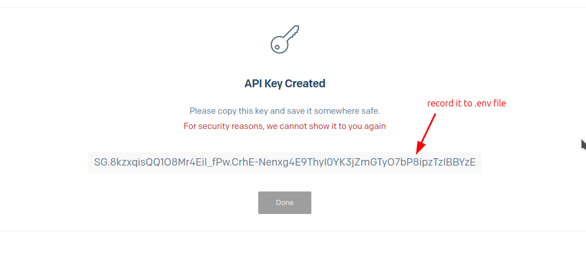

# Get SENDGRID_API_KEY from Sendgrid website

For the last step of [[2024-11-22_Stripe-Integration-flow|Stripe Integration flow]], we want to send ebook through email. For that, we need to get the `SENDGRID_API_KEY` from the Sendgrid website.






This API key can be used to send emails through Sendgrid, so it must be stored securely and not shared with anyone. Best place to store this key is private env variable in the `.env` file.

```bash
# .env
PUBLIC_STRIPE_KEY=pk_test_xxxx...
STRIPE_API_KEY=sk_test_xxxx...
PUBLIC_PRICE_ID=price_xxxx...
PUBLIC_FRONTEND_URL=http://localhost:5173

# store Sendgrid API key here, it must be private (No PUBLIC_ prefix)
SENDGRID_API_KEY=SG.xxxx...
```
