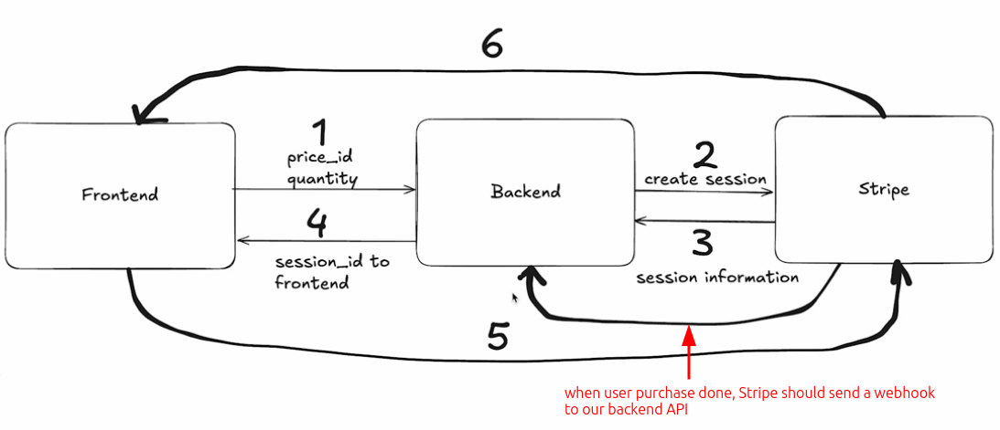

# The last step(7) of Strip integration flow

In addition to the six steps in [[2024-11-22_Stripe-Integration-flow|Stripe Integration flow]], there is also a seventh step (last one) that must be completed, which consists of two sub-steps.

1. Send Purchase Information from Stripe to our backend, we have to create an endpoint to listen for potential purchases

2. When a purchase is received, send out digital product via email!

We will use the SendGrid API to send out the digital product via email. So we should have a SendGrid account and an API key. [[2024-11-23_Get-SENDGRID_API_KEY-from-Sendgrid-website|This topic]] is about how to get the API key from the SendGrid website.

We will add this step to the flow graph as follows:

