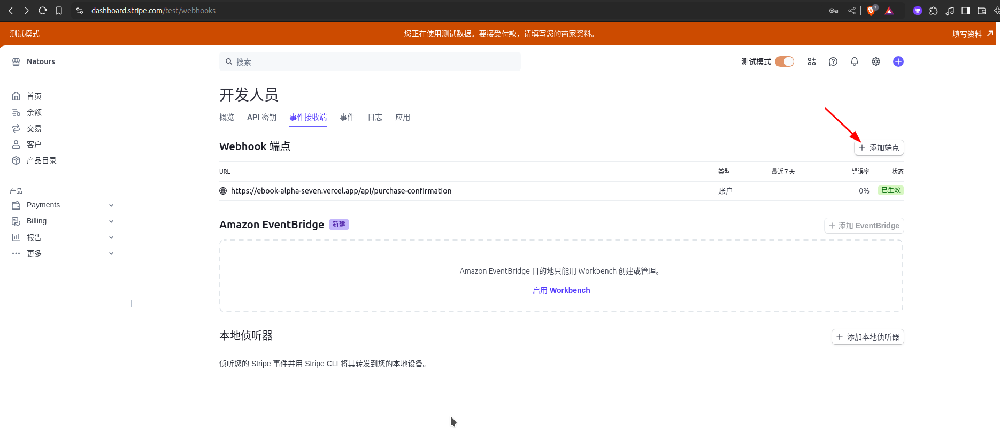
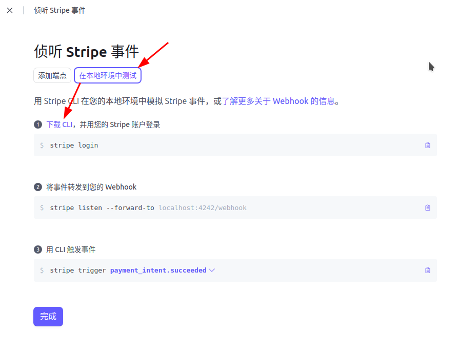
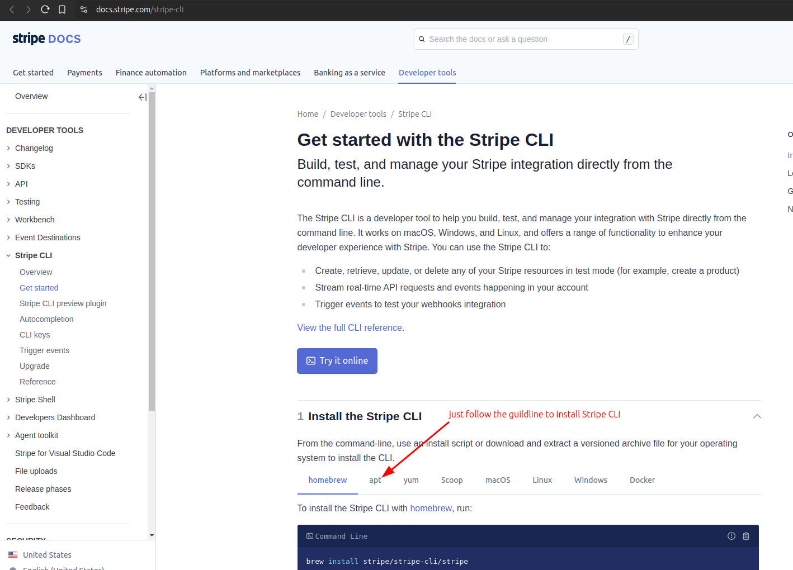

# Using Stripe CLI to forward webhook to localhost

In [[2024-11-23_Create-Stipe-webhook-of-session-complete-to-the-public-API-of-our-project|this topic]], we created a Stripe webhook to our production API endpoint, but it is not convenient to test the webhook in this way. We can use the Stripe CLI to forward the webhook to our localhost server for testing purposes.







According to the above document to:
1. Install stripe cli
2. Login stripe

Then we use the following command to have the Stripe CLI listen for specific events and forward these events to our localhost server:

```bash
~/D/g/s/s/ebook-landing > stripe listen --forward-to localhost:5173/api/purchase-confirmation --events checkout.session.completed
> Ready! You are using Stripe API Version [2023-10-16]. Your webhook signing secret is whsec_1ce4fce3518b86a8bcbeb4fdfae3fe901fa51d5c13ccc1c1253f5f516a9e2e97 (^C to quit)

# now it is listening for events and forwarding them to localhost:5173/api/purchase-confirmation

```
