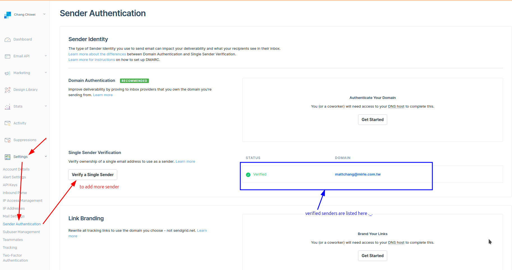

# Send email through SendGrid


## Collecting webhook informations, create message and send email

```ts
// src/routes/api/purchase-confirmation/+server.ts

import { json, type RequestHandler } from "@sveltejs/kit";
import sgMail from "@sendgrid/mail";  // `npm i @sendgrid/mail`
import { SENDGRID_API_KEY } from "$env/static/private";  
//       ^^^^^^^^^^^^^^^^ from SendGrid dashboard and stored in .env file as private variable

sgMail.setApiKey(SENDGRID_API_KEY);  // Set the API key to authenticate with SendGrid

export const POST: RequestHandler = async ({ request }) => {

  // Parse the request body as JSON
  const requestBody = await request.json();

  // Extract the customer's email and name from the request body
  const customerEmail = requestBody.data.object.customer_details.email;
  const customerName = requestBody.data.object.customer_details.name;

  // Create the message object for the email
  const message = {
    to: customerEmail,
    from: "echoedinvoker@gmail.com",  // Sender's email address must registered in SendGrid
    subject: "Your Purchase Confirmation - Complete Spain Relocation Guide",

    // You can write whatever HTML content you want in the email
    html: `
    <h1>Thank You for Your Purchase!</h1>
    <p>Dear ${customerName},</p>
    <p>We appreciate your purchase of the <strong>Complete Spain Relocation Guide</strong>. We're confident that this ebook will provide you with the insights and advice you need to make your move to Spain as smooth and stress-free as possible.</p>
    <p><strong>What happens next?</strong></p>
    <ul>
      <li>You will find your ebook attached to this email. Please download and save it for future reference.</li>
      <li>A separate purchase confirmation has been sent to your email as well.</li>
      <li>If you have any questions or need further assistance, don't hesitate to reach out to us at support@kizo-agency.com.</li>
    </ul>
    <p>Thank you once again for choosing our guide. We wish you the best of luck on your journey to Spain!</p>
    <p>Best regards,<br/>The Kizo Agency Team</p>
  `,
  };

  await sgMail.send(message); // Send the email by calling the send method on sgMail

  return json({ response: "Email sent" });
  //            ^^^^^^^^^^^^^^^^^^^^^^ to let frontend know that the email was sent successfully
}

```


## Sender's email address must be registered in SendGrid

You need to make sure the sender's email address is registered in SendGrid as below:




## Security issue

In fact, anyone can send a POST request to our API endpoint, it's not secure. So we better to check the request SendGrid signature to make sure the request is from SendGrid.
[[2024-11-24_How-to-secure-your-stripe-webhook|Here]] is the topic to further explain how to secure our API endpoint.

