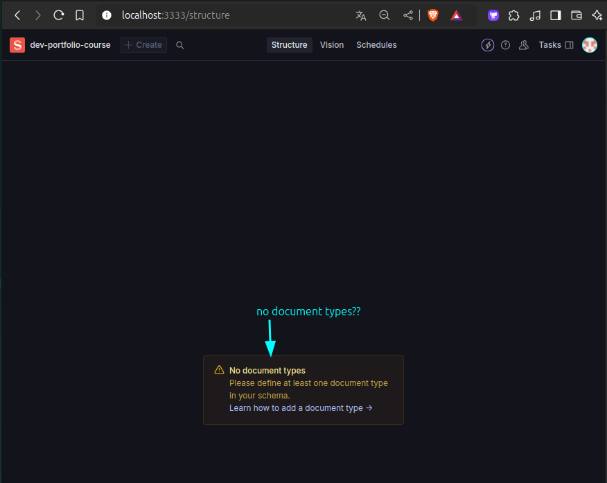
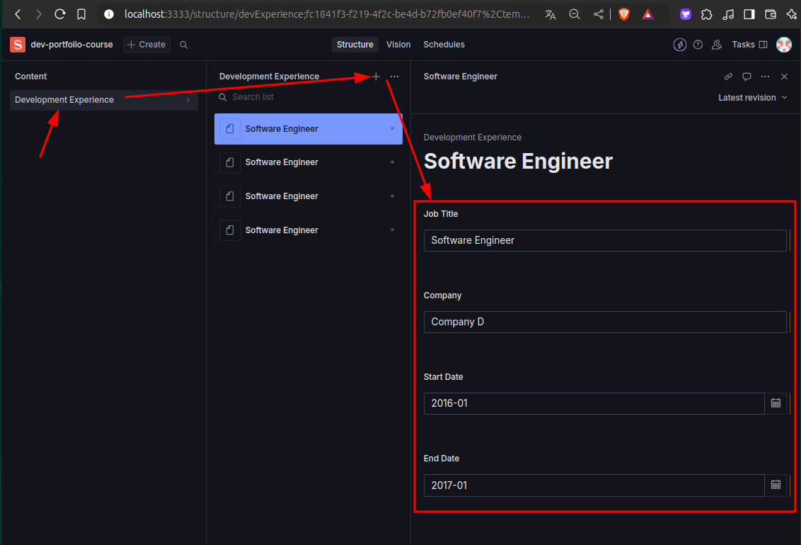

# Set document type of sanity project

```bash
~/D/g/s/s/studio-dev-portfolio-course > npm run dev
#                                       ^^^^^^^^^^^ start our local sanity studio

> dev-portfolio-course@1.0.0 dev
> sanity dev

✅ Checking configuration files...
Sanity Studio using vite@4.5.5 ready in 1960ms and running at http://localhost:3333/
#                                                             ^^^^^^^^^^^^^^^^^^^^^^ 

```


The message above indicates that we need to set the **document type** in order to start using Sanity Studio. Although Sanity Studio allows us to manage data, the **type of data** needs to be defined in the code as follows:

In our project `dev-portfolio`, we need data type as below:
```ts
  interface WorkExperience {
    title: string;
    company: string;
    startDate: string;
    endDate?: string;
  }
```
So the need to create a new schema in the sanity project:

```bash
~/D/g/s/s/studio-dev-portfolio-course > tree schemaTypes/
schemaTypes/
├── devExperience.ts  # add new schema file, content below
└── index.ts # import the new schema here

```

```ts
// schemaTypes/devExperience.ts 

import { defineType, defineField } from "sanity";

export const devExperience = defineType({
  name: "devExperience", // type name
  title: "Development Experience", // title that shows in the Sanity Studio
  type: "document", // type of the document

  // defining fields that correspond to the interface WorkExperience of our main project
  fields: [
    defineField({
      name: "jobTitle",  // field name
      title: "Job Title",  // title that shows in the Sanity Studio
      type: "string",
      validation: (rule) => rule.required()
    }),
    defineField({
      name: "company",
      title: "Company",
      type: "string",
      validation: (rule) => rule.required()
    }),
    defineField({
      name: "startDate",
      title: "Start Date",
      type: "date",
      validation: (rule) => rule.required(),
      options: { // date type can allows multiple value formats
        dateFormat: "YYYY-MM", // here we only accept year and month
      }
    }),
    defineField({
      name: "endDate",
      title: "End Date",
      type: "date",
      // no validation for optional field
      options: {
        dateFormat: "YYYY-MM",
      }
    }),
  ]
})


// schemaTypes/index.ts 

import { devExperience } from "./devExperience";

export const schemaTypes = [devExperience]
//                          ^^^^^^^^^^^^^ put new schema in the array

```

Then, run the sanity studio again, we can see the development experience schema in the studio and start adding data of this type:



> ...Remember to **publish** (right-bottom button) the data after adding it, or it will not be available in the frontend.

Then, we need to create a [[2024-11-26_Create-frontend-Sanity-client|frontend Sanity client]] in our main project to fetch above data.

And we can also generate Typescript types from the schema above by using Sanity CLI, see [[2024-11-26_Generate-type-from-Sanity-schema|this topic]] for more details.

