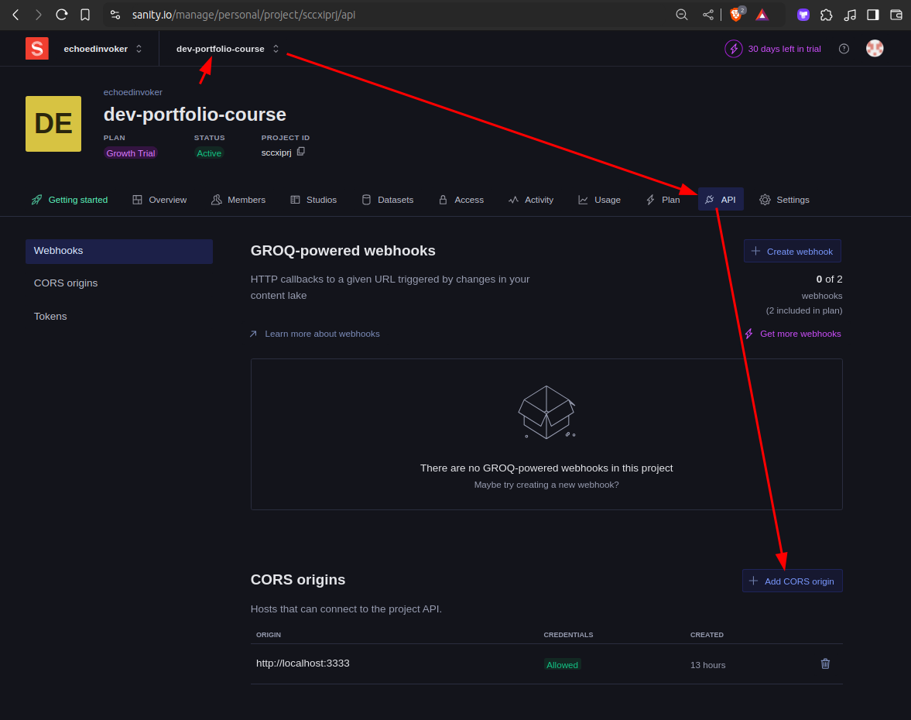
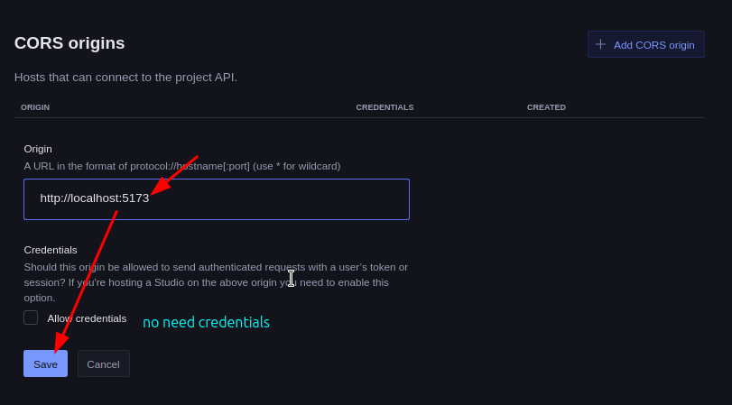

# Fix CORS issue when fetching data from Sanity Studio

Because our main project and the Sanity Studio are hosted on different domains, we need to configure the CORS origins in the Sanity website dashboard.

