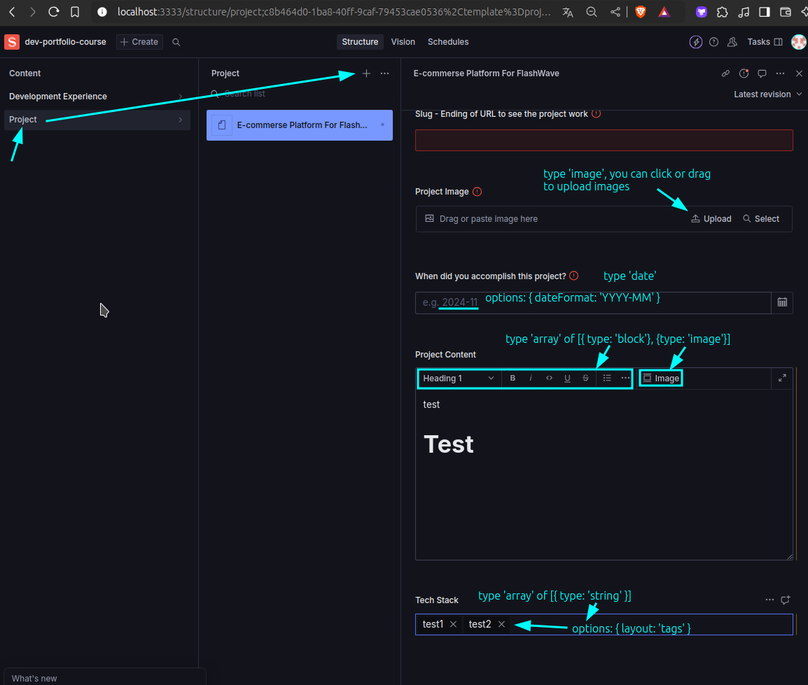

# Create new document schema in Sanity Studio for Work section

```bash
~/D/g/s/s/studio-dev-portfolio-course > tree schemaTypes/
schemaTypes/
├── devExperience.ts
├── project.ts  # New file, to define the project schema, content below
└── index.ts  # import project schema
```

Compare to the [[2024-11-25_Set-document-type-of-sanity-project|devExperience schema]], this one uses more types of fields, like `date`, `array`, and `image`.


```ts
// schemaTypes/project.ts 

import { defineType, defineField } from "sanity";

export const project = defineType({
  name: "project",
  title: "Project",
  type: "document",
  fields: [
    defineField({
      name: "name",
      title: "Project Name",
      type: "string",
      validation: (rule) => rule.required()
    }),
    defineField({
      name: "company",
      title: "Company",
      type: "string",
      validation: (rule) => rule.required()
    }),

    // Data from Sanity can be used anywhere, including the URL, no limitations
    defineField({
      name: "slug",
      title: "Slug - Ending of URL to see the project work",
      type: "string",
      validation: (rule) => rule.required()
    }),

    // Below we use some new types of fields
    defineField({
      name: 'image',
      title: 'Project Image',
      type: 'image',
      //     ^^^^^^ you can upload images to Sanity Studio
      options: {
        hotspot: true  // It allows to crop the image on Sanity Studio
      },
      validation: (rule) => rule.required()
    }),
    defineField({
      name: 'dateAccomplished',
      title: 'When did you accomplish this project?',
      type: 'date',
      validation: (rule) => rule.required(),
      options: {
        dateFormat: 'YYYY-MM',
      }
    }),
    defineField({
      name: 'content',
      title: 'Project Content',
      type: 'array',
      //     ^^^^^
      of: [{ type: 'block' }, { type: 'image' }],
      //     ^^^^^^^^^^^^^^^^^^^^^^^^^^^^^^^^ block means it provide a text editor, and image means add uploading images fn to the text editor
      validation: (rule) => rule.required()
    }),
    defineField({
      name: 'stack',
      title: 'Tech Stack',
      type: 'array',
      //     ^^^^^
      of: [{ type: 'string' }],
      //     ^^^^^^^^^^^^^^ means you can add multiple strings
      options: {
        layout: 'tags'  // make it look like tags on Sanity Studio
      }
    }),
  ]
})
```

```ts
~/D/g/s/s/studio-dev-portfolio-course > cat schemaTypes/index.ts
import { devExperience } from "./devExperience";
import { project } from "./project";

export const schemaTypes = [devExperience, project];
//                                         ^^^^^^^ Add the new schema here
```

In Sanity Studio, the fields above will look like this:




Finally, generate the types for the new schema as [[2024-11-26_Generate-type-from-Sanity-schema|this topic]], add type `Project` add related types to  `sanity.d.ts` file in the main project.
