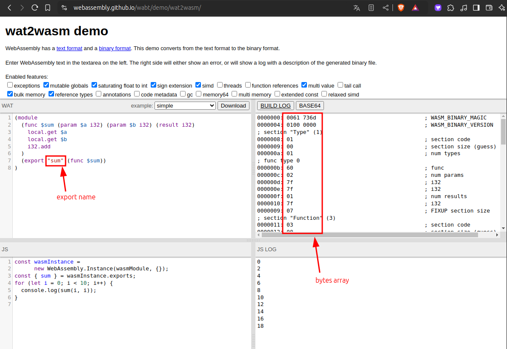
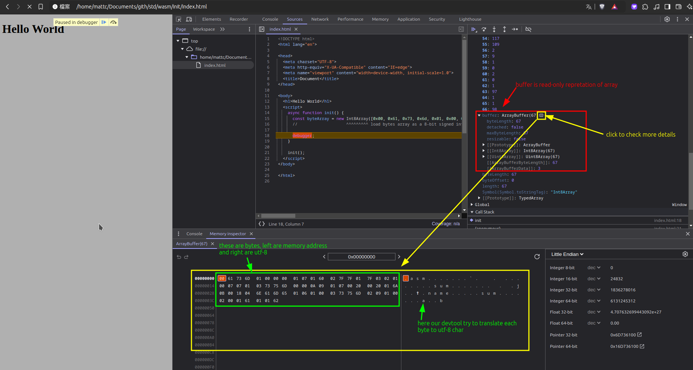
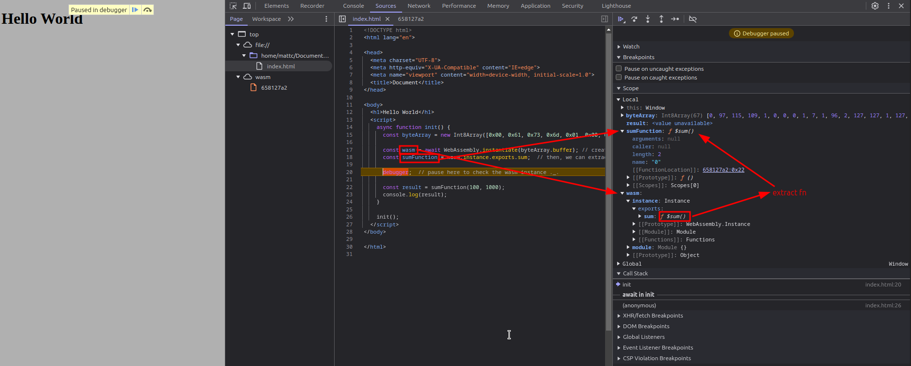
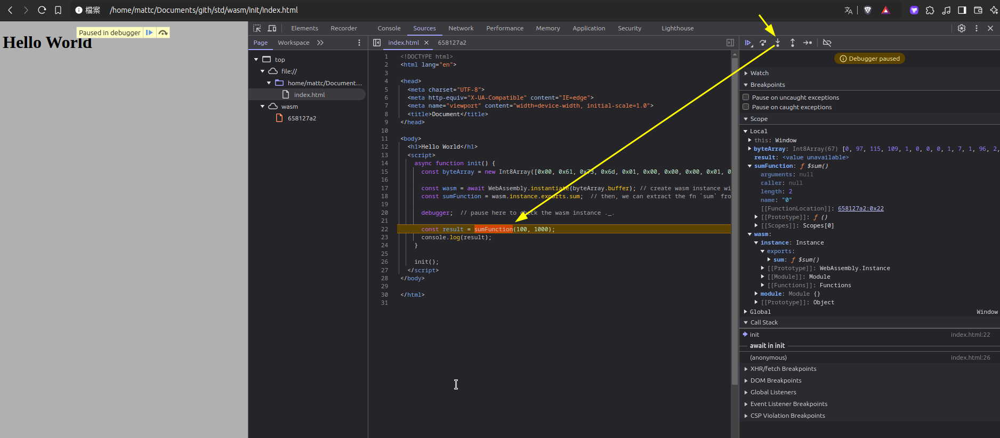
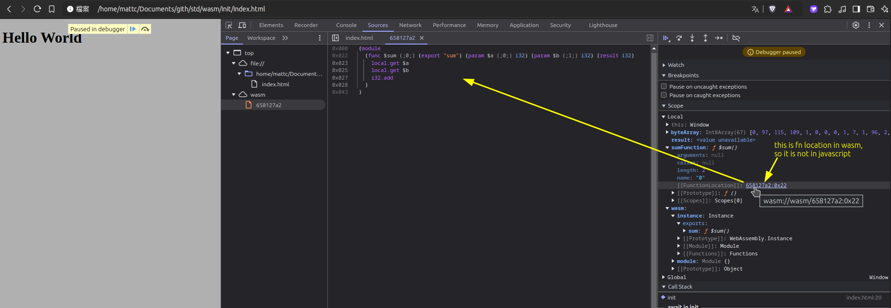

# Initiate wasm from bytes array



```html
<!DOCTYPE html>
<html lang="en">

<head>
  <meta charset="UTF-8">
  <meta http-equiv="X-UA-Compatible" content="IE=edge">
  <meta name="viewport" content="width=device-width, initial-scale=1.0">
  <title>Document</title>
</head>

<body>
  <h1>Hello World</h1>
  <script>
    async function init() {
      const byteArray = new Int8Array([0x00, 0x61, 0x73, 0x6d, 0x01, 0x00, 0x00, 0x00, 0x01, 0x07, 0x01, 0x60, 0x02, 0x7f, 0x7f, 0x01, 0x7f, 0x03, 0x02, 0x01, 0x00, 0x07, 0x07, 0x01, 0x03, 0x73, 0x75, 0x6d, 0x00, 0x00, 0x0a, 0x09, 0x01, 0x07, 0x00, 0x20, 0x00, 0x20, 0x01, 0x6a, 0x0b, 0x00, 0x18, 0x04, 0x6e, 0x61, 0x6d, 0x65, 0x01, 0x06, 0x01, 0x00, 0x03, 0x73, 0x75, 0x6d, 0x02, 0x09, 0x01, 0x00, 0x02, 0x00, 0x01, 0x61, 0x01, 0x01, 0x62]);
      //                    ^^^^^^^^^ load bytes array as a 8-bit signed integer array       ^^^^ this is ONE byte, represented in hexadecimal, there are 64 bytes in this array

      debugger; // to pause execution
    }

    init();
  </script>
</body>

</html>

```




```html
<!DOCTYPE html>
<html lang="en">
  <head>
    <meta charset="UTF-8">
    <meta http-equiv="X-UA-Compatible" content="IE=edge">
    <meta name="viewport" content="width=device-width, initial-scale=1.0">
    <title>Document</title>
  </head>
  <body>
    <h1>Hello World</h1>
    <script>
      async function init() {
        const byteArray = new Int8Array([0x00, 0x61, 0x73, 0x6d, 0x01, 0x00, 0x00, 0x00, 0x01, 0x07, 0x01, 0x60, 0x02, 0x7f, 0x7f, 0x01, 0x7f, 0x03, 0x02, 0x01, 0x00, 0x07, 0x07, 0x01, 0x03, 0x73, 0x75, 0x6d, 0x00, 0x00, 0x0a, 0x09, 0x01, 0x07, 0x00, 0x20, 0x00, 0x20, 0x01, 0x6a, 0x0b, 0x00, 0x18, 0x04, 0x6e, 0x61, 0x6d, 0x65, 0x01, 0x06, 0x01, 0x00, 0x03, 0x73, 0x75, 0x6d, 0x02, 0x09, 0x01, 0x00, 0x02, 0x00, 0x01, 0x61, 0x01, 0x01, 0x62]);

        const wasm = await WebAssembly.instantiate(byteArray.buffer); // create wasm instance with byteArray
        const sumFunction = wasm.instance.exports.sum;  // then, we can extract the fn `sum` from the wasm instance

        debugger;  // pause here to check the wasm instance ._.

        const result = sumFunction(100, 1000);
        console.log(result);
      }

      init();
    </script>
  </body>
</html>

```








