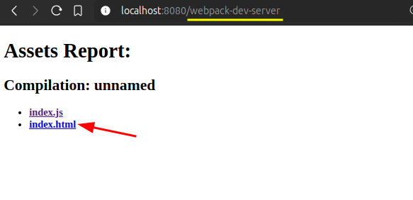

# Move index.html out of public folder

From the developer's perspective, `index.html` should also be considered as part of the source codes, not assets. Therefore, `index.html` should be moved out of the `public` folder in order to make it easier for developers to manage source codes.

But webpack only serve `index.html` in the output path, if we move it out of the `public` folder, webpack can't serve it anymore. So we need to use a plugin to copy `index.html` to the output path with `index.js` together (but no compile, just copy).


Install `copy-webpack-plugin`:

```bash
~/D/g/s/w/init > npm i copy-webpack-plugin

```

Initialize the plugin in `webpack.config.js` and set its configuration:

```js
const path = require('path');
const CopyWebpackPlugin = require('copy-webpack-plugin'); // import `copy-webpack-plugin`

module.exports = {
  entry: './index.js',
  output: {
    path: path.resolve(__dirname, 'public'),
    filename: 'index.js'
  },
  mode: 'development',

  // initialize it in the plugins array
  plugins: [
    new CopyWebpackPlugin({
      // set its configuration here
      patterns: [
        {
          from: './index.html', // `from` is based on the root path of the project
          to: './'  // `to` is based on the output path and no need to specify the filename
        },
        // so above configuration will copy `index.html` from the root path to the output path
      ]
    })
  ]
}

```
Then, we run the development server:
```bash
npm run dev
```



And its copy don't be stored in the output folder:

```bash
~/D/g/s/w/init > tree public/
public/

```

Just like `index.js`, we can run `webpack build` to build the files for production and store them in the output path:

```bash
~/D/g/s/w/init > npm run build

> init@1.0.0 build
> webpack build

asset index.js 1.8 KiB [emitted] (name: main)
asset index.html 314 bytes [emitted] [from: index.html] [copied]
./index.js 651 bytes [built] [code generated]
webpack 5.96.1 compiled successfully in 108 ms

~/D/g/s/w/init > tree public/
public/
├── index.html
└── index.js

```
