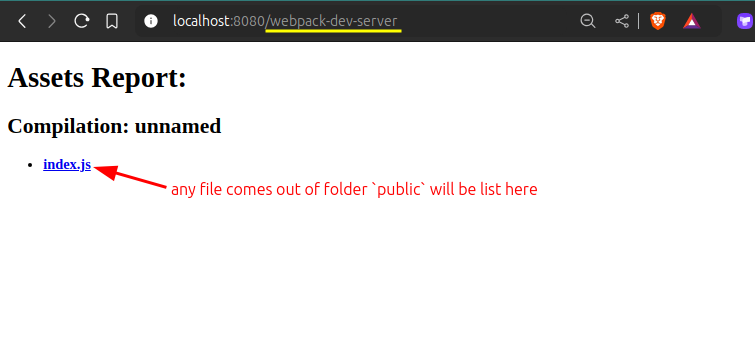
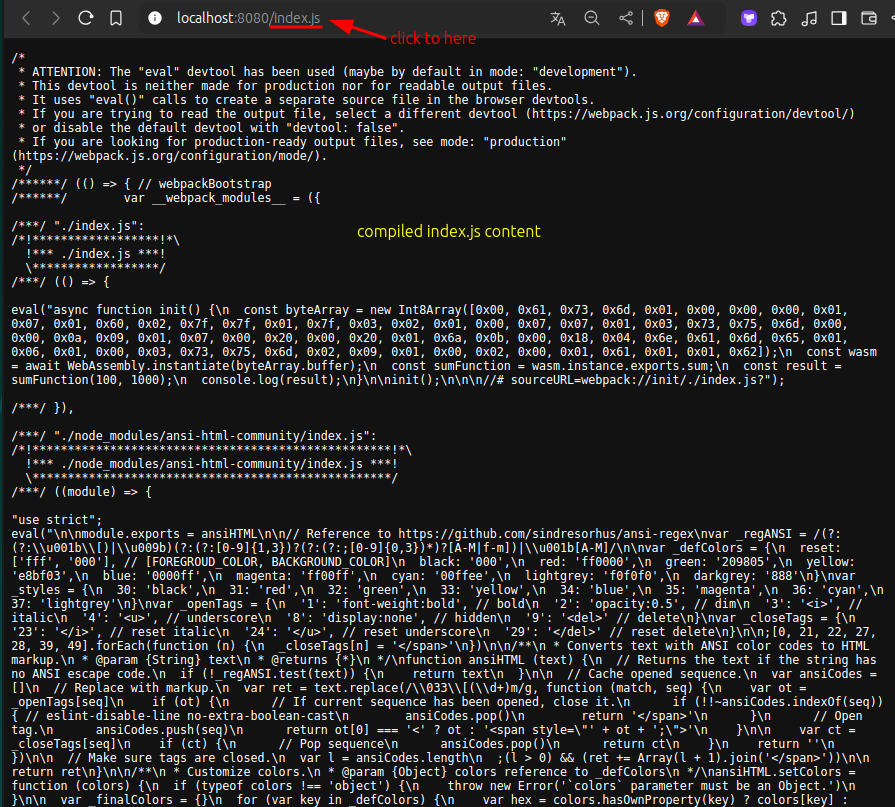

# Where is the output index.js?

In [[2024-11-28_Use-Webpack-to-serve-init-index.html|this topic]], we said that webpack compile `index.js` to `public/index.js` when `npm run dev` but we didn't see `public/index.js` in the project folder.
Where is the output `index.js`?

In fact, the output `index.js` is just in memory, but we still can find it on the URL: `http://localhost:8080/webpack-dev-server as below:






But it won't be saved to the disk:

```bash
~/D/g/s/w/init > tree public/
public/
└── index.html
# no index.js exists
```

If we really need to save it to the disk, we can use command `webpack build` to compile it and save the output file to the disk, we can make a script in `package.json`:

```json
{
  "name": "init",
  "version": "1.0.0",
  "main": "index.js",
  "scripts": {
    "dev": "webpack-dev-server",
    "build": "webpack build" # add this line
  },
  "keywords": [],
  "author": "Matt Chang",
  "license": "ISC",
  "description": "",
  "dependencies": {
    "webpack": "^5.96.1",
    "webpack-cli": "^5.1.4"
  },
  "devDependencies": {
    "webpack-dev-server": "^5.1.0"
  }
}

```

```bash
~/D/g/s/w/init > npm run build

> init@1.0.0 build
> webpack build

asset index.js 1.8 KiB [emitted] (name: main)
./index.js 651 bytes [built] [code generated]
webpack 5.96.1 compiled successfully in 66 ms

~/D/g/s/w/init > tree public/
public/
├── index.html
└── index.js  # now index.js exists

```

Usually, buidling the project is for production only. For development, we don't need to save the output file to the disk, we can just use the in-memory output file.

