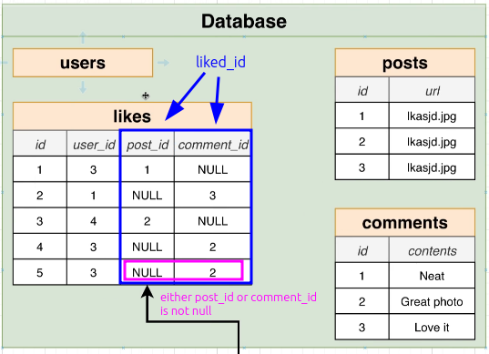

# Alternate Polymorphic Association Design

In [[2025-01-18_Polymorphic-Associations|this topic]], we said that polymorphic associations design is a bad idea because `liked_id` cannot be foreign key.

So, the alternate design is a bit straightforward. We just divide the `liked_id` column into two columns: `post_id` and `comment_id`.


This way, because `post_id` and `comment_id` are related to their respective tables, they can be foreign keys, so we can get the benefits of referential integrity.

But now, the uniqueness will be:

```sql
ALTER TABLE likes ADD CONSTRAINT unique_like
UNIQUE (user_id, post_id, comment_id);

```

And most importantly, we MUST make sure that `post_id` and `comment_id` are not both `NULL` or `INTEGERS` at the same time, we can add a CHECK constraint for that:

```sql
ALTER TABLE likes ADD CONSTRAINT check_like
CHECK (
  (
    COALESCE((post_id)::BOOLEAN::INTEGER, 0)
    +
    COALESCE((comment_id)::BOOLEAN::INTEGER, 0)
  ) = 1
);

```
Above CHECK constraint will make sure that either `post_id` or `comment_id` is `NOT NULL` and the other is `NULL`.

If you're not familiar with `COALESCE` function, see [[2025-01-18_function-COALESCE|this topic]] for more details.

The only downside of this design is that if we want to allow user to like multiple things, we have to add lots of columns like `photo_id`, `video_id`, etc. The likes table will grow horizontally too much.
