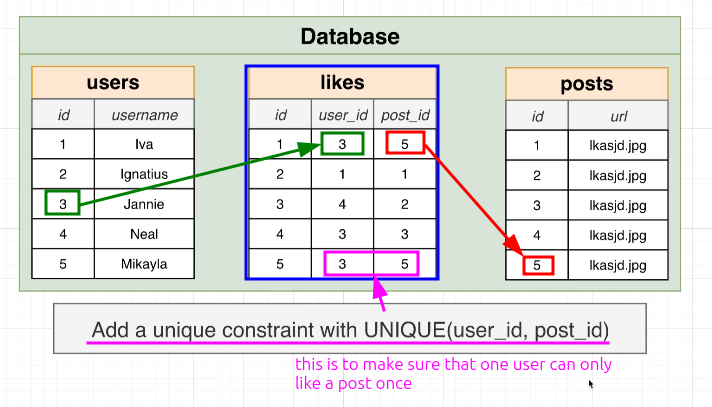

# Designing a Like System


## Good Design

In [[2025-01-18_How-Not-to-Design-a-Like-System|this topic]], we saw a bad way to design a like system. Now, let's see a good way to design a like system.




## Querying

Then, we can do lots of query like:

**Unliking a post**

```sql
DELETE FROM likes
WHERE post_id = 1 AND user_id = 1;

```

**# of likes on a post with id 3**

```sql
SELECT COUNT(*)
FROM likes
WHERE post_id = 3;

```

**Username of people who liked post with id 3**

```sql
SELECT username
FROM likes
JOIN users ON users.id = likes.user_id
WHERE post_id = 3;

```

**Id's of top five most liked posts**

```sql
SELECT posts.id
FROM posts
JOIN likes ON likes.post_id = posts.id
GROUP BY posts.id
ORDER BY COUNT(*) DESC
LIMIT 5;

```

**URL of posts that user with id 4 liked**

```sql
SELECT url
FROM likes
JOIN posts ON posts.id = likes.post_id
WHERE user_id = 4;

```


## Drawbacks

However, this design still has some shortcomings that cannot meet certain requirements in [[2025-01-18_Requirements-of-a-Like-System|this topic]].


**users cannot give a different reaction**

In this system, users can only like, and cannot give different reactions such as hearts, smiley faces, etc.


**users can only like a post, not a comment**

In this system, we only associate "like" with "post", but we may also want users to be able to like a comment or even other resources. We will try to address this issue in future topics.


## Not only works for like

This design can be used not only for the like feature, but also for other similar features such as favorite, bookmark, follow, subscribe, vote, rate, upvote, downvote, etc.
