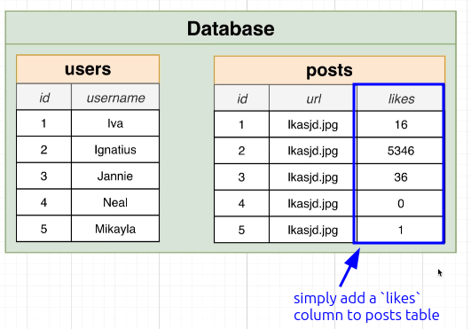

# How Not to Design a Like System

In [[2025-01-18_Requirements-of-a-Like-System|this topic]], we said that we want to design a like system and listed some requirements.

Now, let's see a bad way to design a like system which most new developers do.

The core drawback of this design method is that we cannot know which user liked each post, nor can we know which posts a user liked. This will result in the following disadvantages:

**No way to make sure a user likes a post only once**

Under this design, a user can like a single post multiple times.

**No way to make sure a user can only 'unlike' a post they have liked**

Because we do not know who the user who liked the post is, we cannot confirm if the user can unlike a post.

**No way to figure out which users like a particular post**

Same as above, we do not know who liked the post.

**No way to remove a like if a user gets deleted**

When a user is deleted, the likes they have clicked should also be removed, but since we do not know which user clicked the like, we are unable to remove them.

> Never design a like system like this. We'll see how to design a like system in the next topic.
