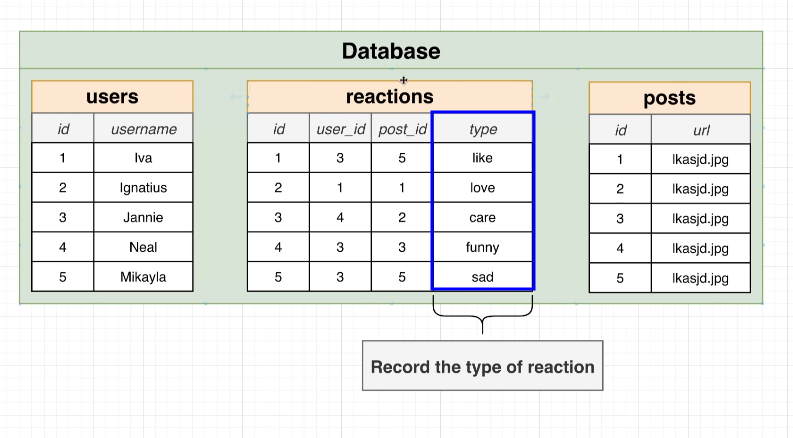

# Making a Reaction System Instead

In [[2025-01-18_Designing-a-Like-System|this topic]], we learned how to design a like system with a good method but still have some limitations.

This topic will discuss how to let users react to posts with different emotions, not just like.

As shown above, simply adding a "type" field can allow users to choose different emojis to respond to the article.

But the value of type is usually limited to specific content, such as like, love, haha, wow, sad, angry, etc. **PostgreSQL's enum type** can help us restrict the values of this field, and we will discuss how to use it in the future.

