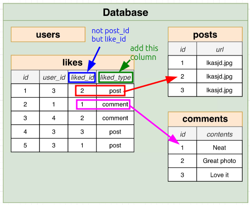

# Polymorphic Associations

In [[2025-01-18_Designing-a-Like-System|this topic]], we discussed how to design a like system with a good method but still have some limitations.

One of the limitations is that users can only like **posts**. But what if we want to like **comments** or **photos**?

There are basically three ways to solve this problem, this topic will discuss the first one: **Polymorphic Associations**.

**Polymorphic Associations** isn't recommended because it's not a good practice but we'll still see lots of codebases using it especially in older Rails projects.

Let's see how it works.

The design above may seem very reasonable at first glance, but in reality it is a very bad design. The core problem of such a design is:

> Column `liked_id` cannot be a foreign key because it reference multiple tables.

Because `liked_id` is not a foreign key, when we add a record to the `likes` table, we cannot guarantee that the record referenced by `liked_id` in another table exists. This causes us to lose the protection mechanism of data consistency provided by foreign keys.

