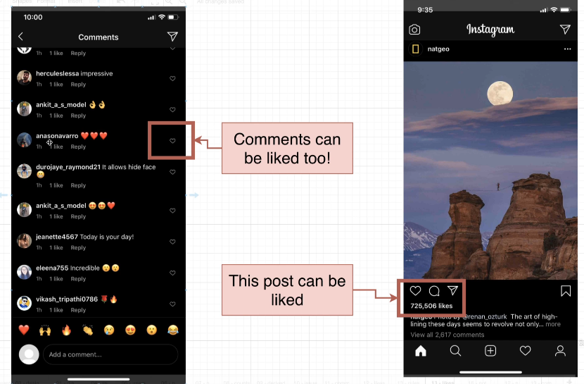

# Requirements of a Like System

Assuming we want to make our database support the like system in the app, what requirements do we need to consider?

## Rules of 'Likes'

**Each user can like a specific post a single time**

Each user can like many different posts or comments, but can only like the same post or comment once.

**A user should be able to 'unlike' a post**

Users should be able to easily unlike their likes.

**Need to be able to figure out how many users like a post**

As shown in the image above, we need to display how many people have liked a post.

**Need to be able to list which users like a post**

We may not need to list out all the users who liked this post, but we may need to be able to list out the top ten most popular users.

**Something besides a post might need to be liked (comments, maybe?)**

Not only posts, but comments, or other things might need to be liked. We need to be able to support this.

**We might want to think about 'dislikes' or other kinds of reactions**

Think about other reactions besides `like`, such as `dislike`, and even `love`, `angry`, `sad`, etc. And users should be able to give only one reaction to a single post. They can easily change their reactions as well.

