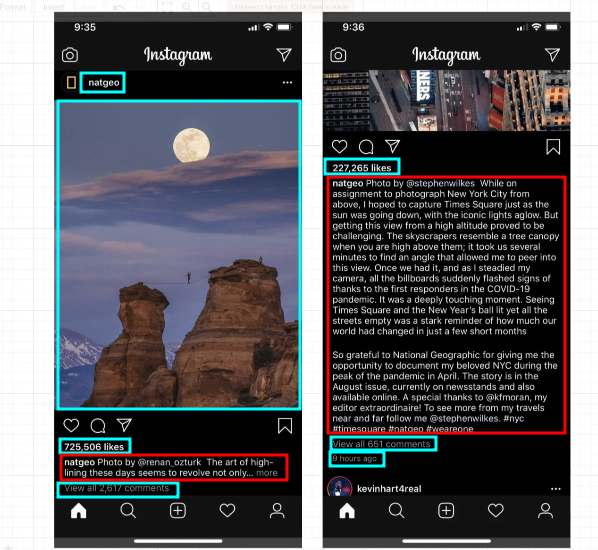
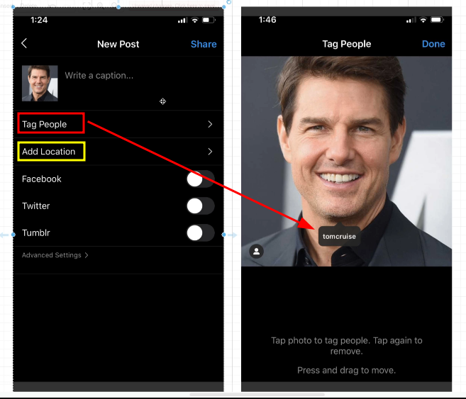

# Additional Features Around Posts

Let's check the post page of our application deeper:

The light blue part is the portion that our current database schema can provide, and the red part is the portion that we currently do not have. This part is the caption, which is a description of the post and can be easily added to the posts table.

We continue to look at creating post pages:

In addition to the caption, this section also has two features that our current database schema cannot provide:

**1. Tag People (red)**

This feature requires binding with other Instagram users, and also needs to provide the location on this photo for the binding.

**2. Add Location (blue)**

When users click this button, their current location will be retrieved from their device and added to their post. Typically, locations are stored in the form of longitude and latitude, so we may need to add two columns in the posts table to represent longitude and latitude.

