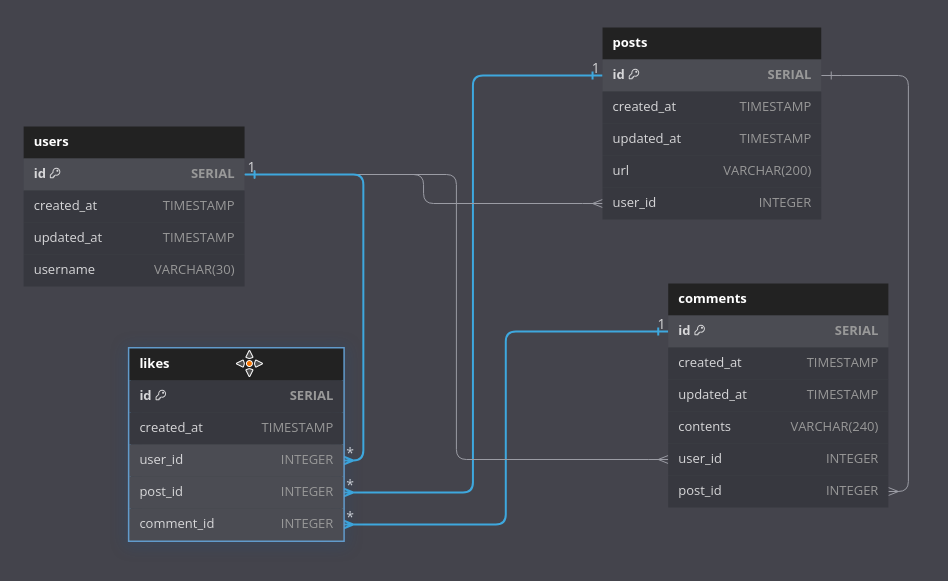

# So Which Approach?

In topic [[2025-01-18_Alternate-Polymorphic-Association-Design|alternate Polymorphic Association Design]] and [[2025-01-20_The-Simplest-Alternative|the simplest Alternative]], we discussed two different approaches to handle Polymorphic associations. So, which one should we choose?

In our case, users can like both posts and comments and there is no extra information or validation for each like. So, the [[2025-01-18_Alternate-Polymorphic-Association-Design|alternate Polymorphic Association Design]] one is better.

Let's add the table `likes` into our [[2025-01-15_Rebuilding-Some-Schema|schema]]:

```js
Table users {
  id SERIAL [pk, increment]
  created_at TIMESTAMP
  updated_at TIMESTAMP
  username VARCHAR(30)
}

Table posts {
  id SERIAL [pk, increment]
  created_at TIMESTAMP
  updated_at TIMESTAMP
  url VARCHAR(200)
  user_id INTEGER [ref: > users.id]
}

Table comments {
  id SERIAL [pk, increment]
  created_at TIMESTAMP
  updated_at TIMESTAMP
  contents VARCHAR(240)
  user_id INTEGER [ref: > users.id]
  post_id INTEGER [ref: > posts.id]
}

// new table for like system
Table Likes {
  id SERIAL [pk, increment]
  created_at TIMESTAMP
  // no need to updated_at, like is either there or not
  user_id INTEGER [ref: > users.id]
  post_id INTEGER [ref: > posts.id]
  comment_id INTEGER [ref: > comments.id]
}

```



