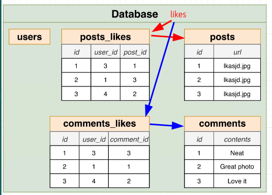

# The Simplest Alternative

In [[2025-01-18_Alternate-Polymorphic-Association-Design|this topic]], we fixed polymorphic association issue with one likes table, but it'll grow too many columns if there are too many different resources need to be liked.

We can simply resolve that issue by split table likes to multiple tables like `post_likes`, `comment_likes`, `photo_likes`, `video_likes`, etc.

Above, we simply avoided having too many columns, and besides the id, all other fields are foreign keys, which ensures referential integrity.

This method can also conveniently perform different operations on different resources, for example, `post_likes` can have two operations: `like` and `dislike`, while `comment_likes` only has the `like` operation, or they may have different CHECK constraints, etc.

However, the downside is also very obvious, that is, when we want to query all the likes of a user at once, we have to query multiple tables. However, we can use `UNION` or `VIEW` to solve this problem.
