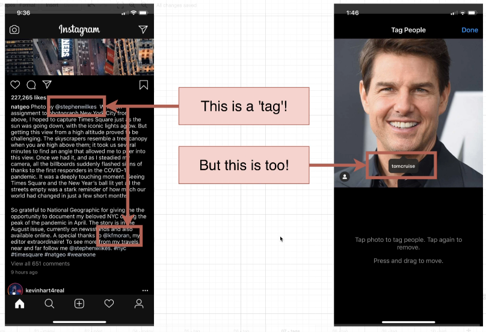
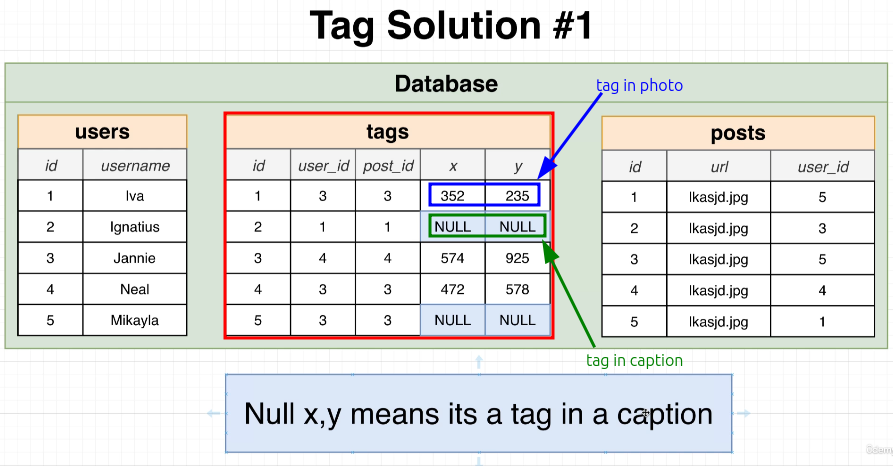
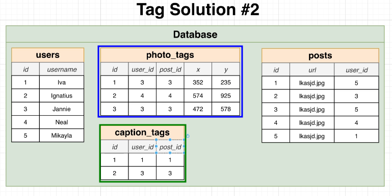

# Considerations on Photo Tags vs Caption Tags

In [[2025-01-20_Photo-Mentions-vs-Caption-Mentions|this topic]], we discussed two different tags in our app: photo tags and caption tags.

Although they may seem very different, the ultimate goal of these two tags is to attract the attention of the tagged object and let them know they have been tagged. Therefore, we can consider them as a type of resource to manage.

However, some people believe that they are not the same resource, so they should be managed separately. This is also reasonable.

It is obvious that when we need to query all tags, solution 1 will be more convenient, but the main decision between these two methods is determined by the following two points:

**1. Do you expect to query for caption_tags and photo_tags at different rates?**

If one tag has a high query frequency while the other is okay, they should be managed separately. We must do some performance optimization for the high-frequency table. It will be more difficult to do performance optimization for Solution 1's table.

**2. Will the meaning of a photo_tag change at some point?**

In other words, do we ever want to add in more functionality to a photo tag? If so, it should be managed separately. Then, we could start to make changes to the photo_tag table without affecting the caption_tag table.
