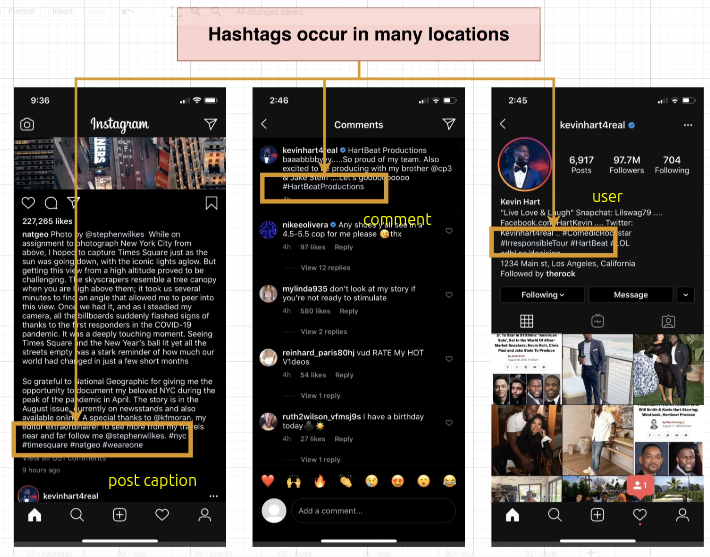
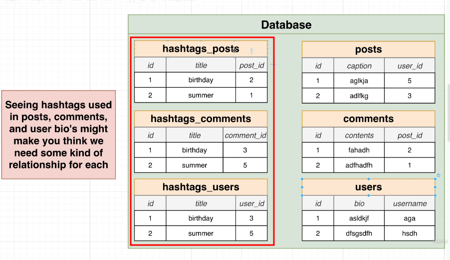
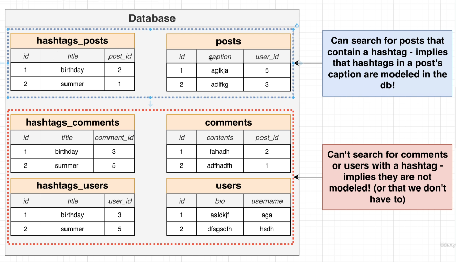
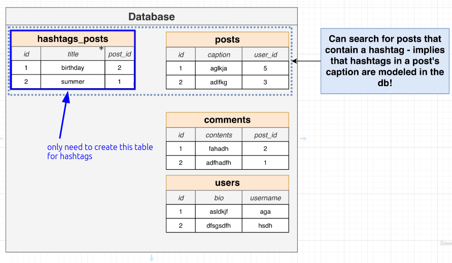

# Designing a Hashtag System

There are many places using hashtags in our app:

According to previous learning, we can design a hashtag system as follows:

This is [[2025-01-18_Polymorphic-Associations|polymorphic Associations]] problem, so you can also only use one table to store all the hashtags.

> But the key point is, do we really need to query these hashtags? If we never need to query hashtags, then we don't need to store them in the database at all.

Let's check our app to resolve this problem:

As above, we found that in the search function, you can search for hashtags, and clicking on them will display all related posts. However, it is obvious that these hashtags are only found in the captions of posts, and no functionality has been found for hashtags in user profiles or comments.

So the hashtag_comments and hashtag_users in the bottom left of the image will never be queried, so they do not need to be stored in the database.

