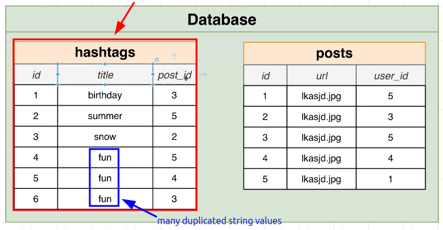
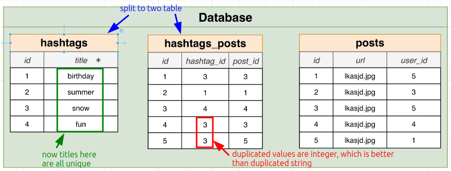

# Tables for Hashtags

In [[2025-01-21_Designing-a-Hashtag-System|this topic]], we've known that we only need to create a hashtags table related to the posts.

The above method will work, but there will be many duplicate hashtag titles, which will cause a performance issue. We can optimize it by creating a separate table for hashtags as follows:

Duplicate numerical values will perform much better than duplicate strings in terms of performance.

