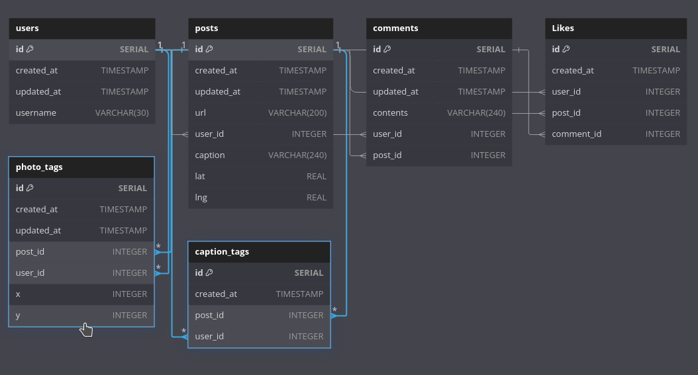

# Update For Tags

In [[2025-01-21_Considerations-on-Photo-Tags-vs-Caption-Tags|this topic]], we discussed how to manager photo tags and caption tags. We decided to use solution 2 - create two separate tables for photo tags and caption tags.

Let's add them to our schema:

```js
Table users {
  id SERIAL [pk, increment]
  created_at TIMESTAMP
  updated_at TIMESTAMP
  username VARCHAR(30)
}

Table posts {
  id SERIAL [pk, increment]
  created_at TIMESTAMP
  updated_at TIMESTAMP
  url VARCHAR(200)
  user_id INTEGER [ref: > users.id]
  caption VARCHAR(240)
  lat REAL
  lng REAL
}

Table comments {
  id SERIAL [pk, increment]
  created_at TIMESTAMP
  updated_at TIMESTAMP
  contents VARCHAR(240)
  user_id INTEGER [ref: > users.id]
  post_id INTEGER [ref: > posts.id]
}

Table Likes {
  id SERIAL [pk, increment]
  created_at TIMESTAMP
  user_id INTEGER [ref: > users.id]
  post_id INTEGER [ref: > posts.id]
  comment_id INTEGER [ref: > comments.id]
}

Table photo_tags {
  id SERIAL [pk, increment]
  created_at TIMESTAMP
  updated_at TIMESTAMP // maybe user tag wrong person or not in correct position
                       // they can update the tag in the app, so updated_at is needed
  post_id INTEGER [ref: > posts.id]
  user_id INTEGER [ref: > users.id]
  x INTEGER
  y INTEGER
}

Table caption_tags {
  id SERIAL [pk, increment]
  created_at TIMESTAMP
  // no updated_at because captions tags just have no any functionality to update
  post_id INTEGER [ref: > posts.id]
  user_id INTEGER [ref: > users.id]
}
```

Even though the photo tag can be updated in the app, the updated_at does not necessarily have to be present. However, we usually include it if the resource is updateable. Often, at some point in the future, we may need to know the time it was updated.


