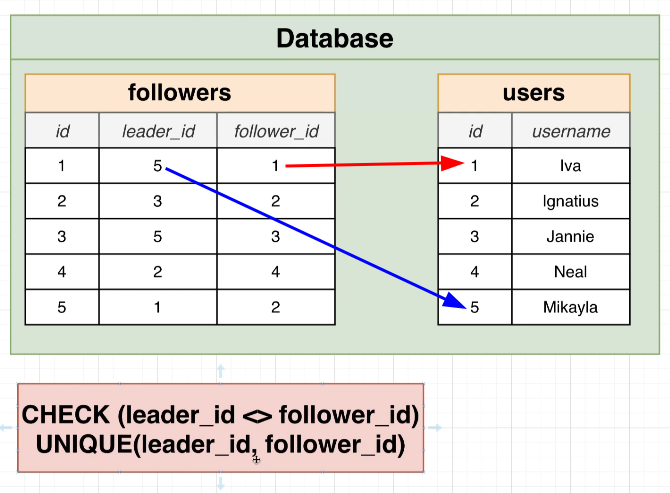
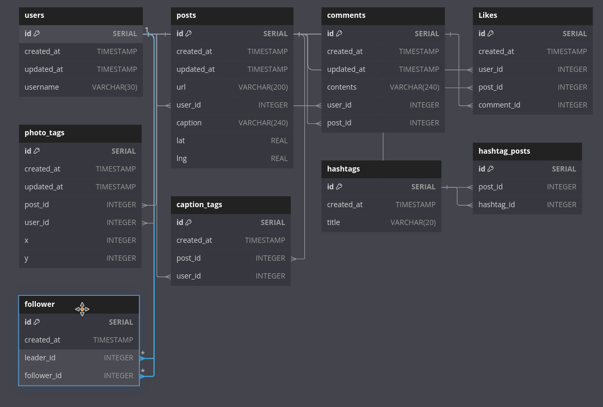

# Designing a Follower System

This system simply links two users together, one as the leader and the other as the follower.

It is important to note that the leader and follower cannot be the same person, and each leader-follower pair is unique. This means that a follower can only follow a leader once. We can use CHECK and UNIQUE to achieve this goal.


Let's add that to our schema.

```js
Table users {
  id SERIAL [pk, increment]
  created_at TIMESTAMP
  updated_at TIMESTAMP
  username VARCHAR(30)
}

Table posts { ... }

Table comments { ... }

Table Likes { ... }

Table photo_tags { ... }

Table caption_tags { ... }

Table hashtags { ... }

Table hashtag_posts { ... }

// create follower table
Table follower {
  id SERIAL [pk, increment]
  created_at TIMESTAMP
  // there is no need to update the follower, only create or delete
  leader_id INTEGER [ref: > users.id]
  follower_id INTEGER [ref: > users.id]
} // we'll add costraints when we really implement this

```





