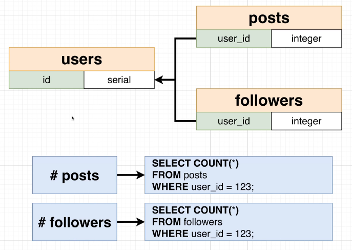

# Why No Number of Follower or Posts?

In [[2025-01-22_A-Few-More-User-Columns|this topic]], we decided not to store numbers of followers or posts to the user table.

## Somewhat Similar to the Like System, but Different

This issue seems to be somewhat similar to [[2025-01-18_How-Not-to-Design-a-Like-System|the problem encountered when implementing the like system]] before, but at that time it was because each like had to be associated with a specific user in order to know who pressed it, but this time there is no such requirement, so theoretically we can actually save these numbers in the user table.

## Computing numbers from other tables is usually very simple

However, it is also very simple to calculate these values directly from other tables:

## derive columns

If the value of a column can be calculated from other columns, then this column is a derived column.

We usually do not use derived columns in tables because it can cause data duplication and increase maintenance costs. Unless there is a significant performance improvement or the query is very complex, only then would we consider using derived columns.

