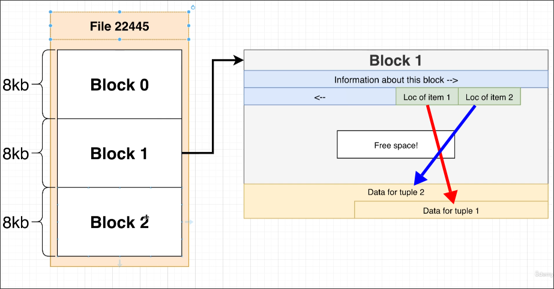
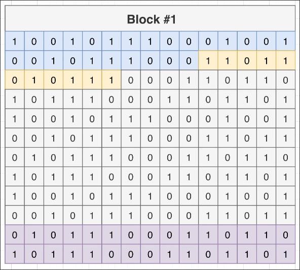

# Block Data Layout

Continuing from the [[2025-01-25_Heaps,-Blocks,-and-Tuples|previous topic]], we will delve deeper into how PostgreSQL uses blocks to truly store data on physical storage devices.

## Diagram to Block

The diagram above shows a detailed view of how PostgreSQL stores data in blocks. Each block is a fixed size of 8KB.

At the start of each block, there is a header that contains metadata about the block itself. Following the header, there are tuples that contain the location of the data in the block, which points to the actual data at the end of the block. Between the tuples and the data, there is a free space that can be used to store new data.

## Binary Storage

In fact, the data stored in the block is binary. PostgreSQL uses a binary format to store data in blocks. This binary format is a sequence of zeros and ones that represent the data stored in the block.

Each collection of zeros and ones in the same color represent a individual information that is stored in physical storage.

