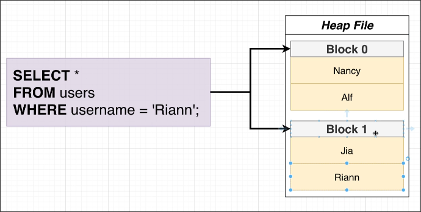
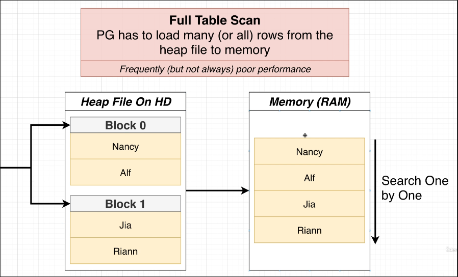

# Full Table Scans

Assuming we have written a query as follows to retrieve the data we want from the data saved on the hard drive.

However, the query cannot directly act on the hard disk. PostgreSQL will first read the data on the hard disk into memory, and then perform the query calculation.

Usually, PostgreSQL will read all the data in the heap file into memory, and then check each record to see if it meets the conditions record by record. This process is called Full Table Scan.

Reading data from the hard drive to memory is a process with very poor performance, so we should try to avoid situations where a Full Table Scan occurs. We will introduce methods to avoid Full Table Scans in future topics.

However, in certain situations, a Full Table Scan is necessary and there is no other alternative, so it is not necessary to completely avoid it.
