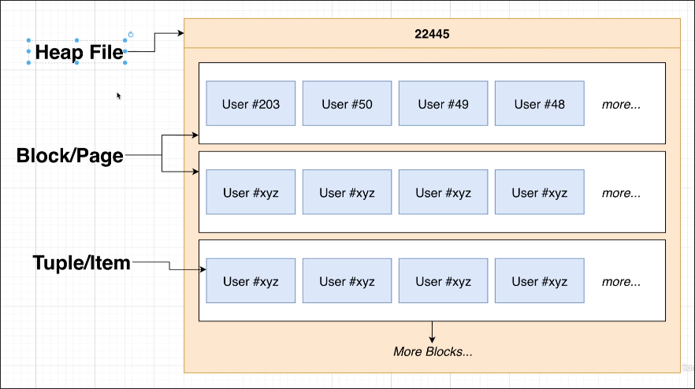
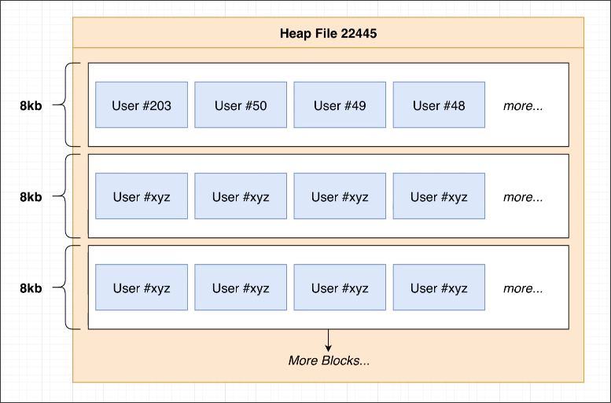

# Heaps, Blocks, and Tuples

## Terminology

*Heap or Heap File*
File that contains all the data (rows) of a particular table.

So, the `16390` file in the `base` directory is a heap file that contains all the rows of the `users` table.

The heap/heap file here is no relation to the heap data structure in computer science.

*Block or Page*
The heap file is divided into many different 'blocks' or 'pages'. Each page/block stores some number of rows.

Each block is 8KB in size by default. It can store no items but still takes up 8KB of space.

*Tuple or Item*
Individual row from the table.

## Visualizing Heaps, Blocks, and Tuples

In the above image, the heap file is divided into blocks. Each block contains tuples.

Each block is 8KB in size. It can store multiple tuples. If a tuple is too large to fit in a block, it is split across multiple blocks.
