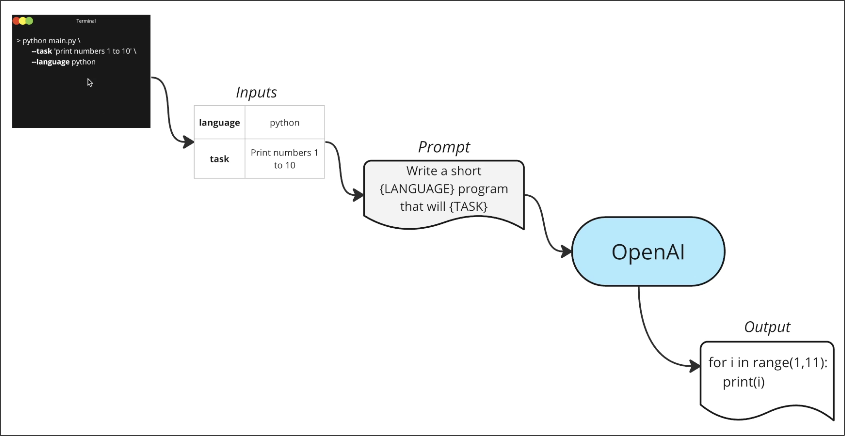
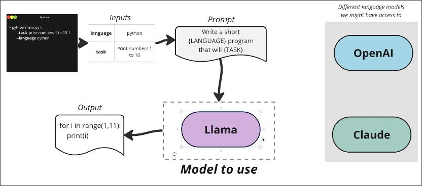
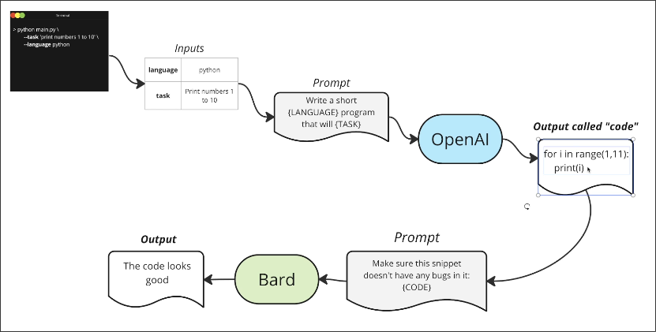
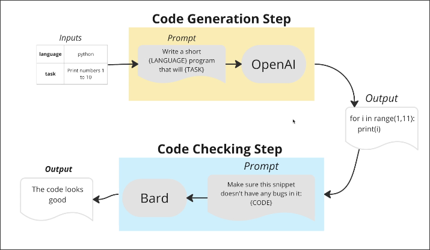
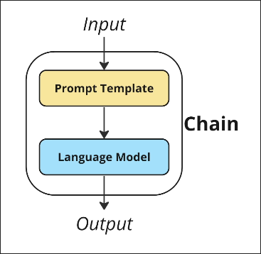
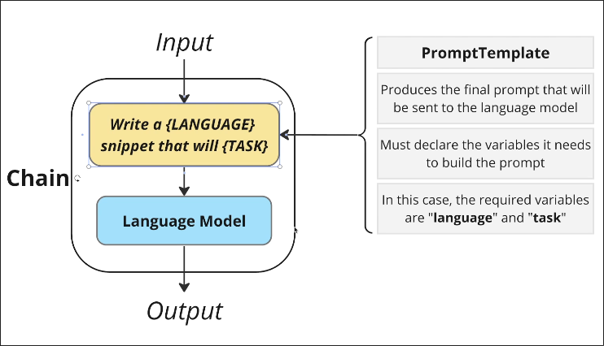
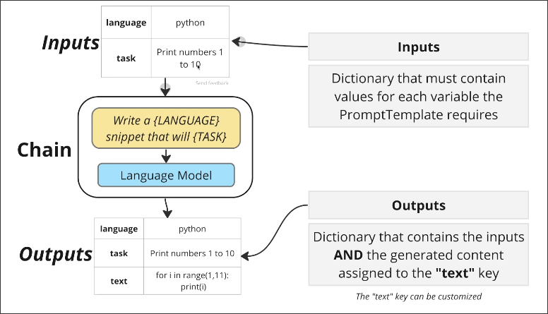
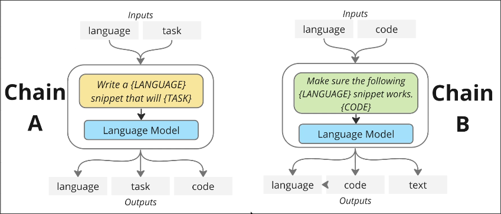

# Introducing Chains

Assuming we want to create an app that allows users to input a *language* and *task*, and then receive the corresponding *code*.

In the above framework, OpenAI's AI model is used, but sometimes there are problems, so the ability to switch models flexibly is needed.

If I need to add some processes after obtaining the code, such as checking for errors, we can easily extend it.

We can see some repeated patterns from the above figure.

Based on the above analysis, the Chain class is proposed. There are two big goals for it:

**1. Provide tools to automate each step of a text generation pipeline**
**2. Make it easy to connect tools together**

- We use Chains to make reusable text-generation pipelines. 
- Chains can be connected together to make a more complex pipeline.
- A chain wraps a *PromptTemplate* and an *LLM*.

PromptTemplate is a class to generate prompts.

LLM is also a class to access the language model.

Chains have Inputs and Outputs before and after, Inputs provide data to PromptTemplate to generate prompts, Outputs then return the generated text and the content of Inputs.

Inputs and Outputs are both dictionaries.

Genrated text is under the key "text", and "text" just is default key, you can change it.

We use the above layout to draw out the front extended app as follows:

Let's review LangChain's two big goals.
**1. Provide tools to automate each step of a text generation pipeline**
**2. Make it easy to connect tools together**

The design of the Chain class is to achieve these two goals, so it is one of the most essential classes in LangChain.

