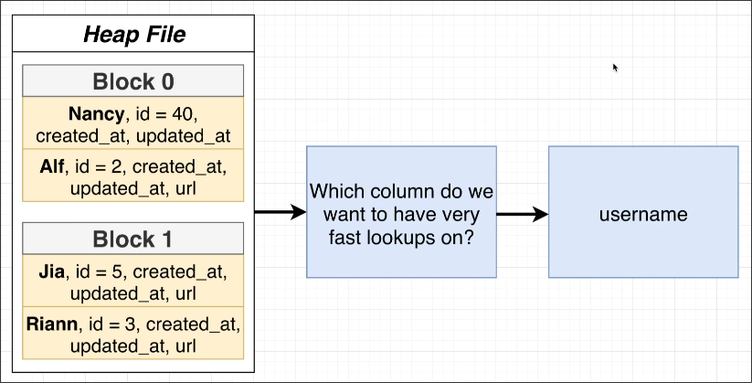
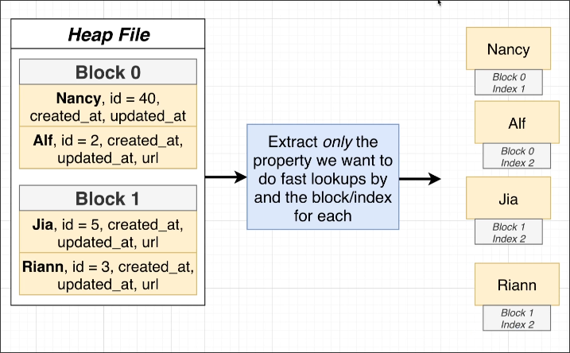
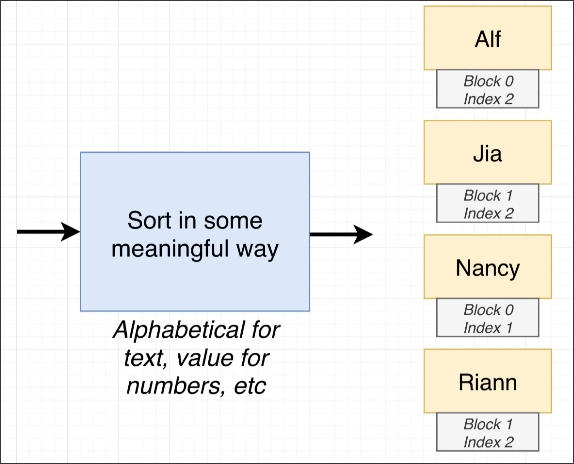
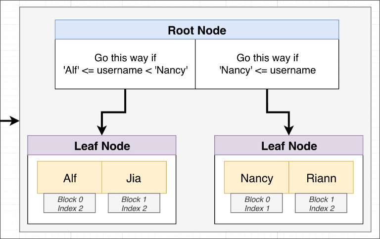

# How an Index Works

```sql
SELECT *
FROM users
WHERE username = 'Riann';
```
Assuming we want to increase the speed of the above query, we can create an index on the `username` column of the `users` table.


Next, extract the value of the username from each record and at the same time remember the position of this record in the heap file.


Then, sort the extracted values in ascending order.


Organize the sorted values in a *tree* data structure.



Now, the index is ready. When we run the query, the database engine will first look up the value in the index tree. Then, it will find the position of the record in the heap file and only load the necessary page into memory.


You can see that the first leaf node is passed by the root node helpers, so the search in the index tree is very fast. This is how an index works.


