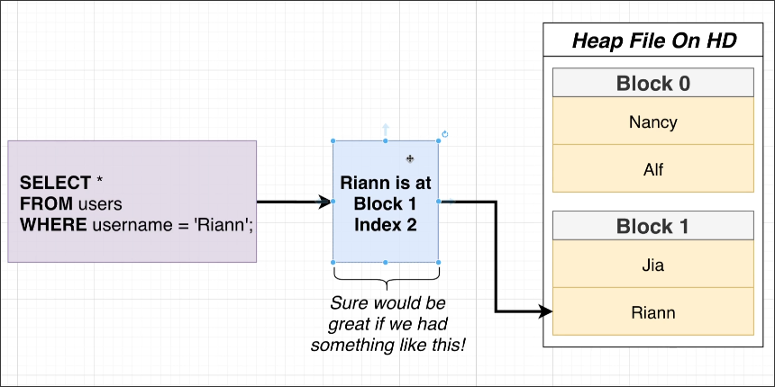

# Whats an Index

In [[2025-01-25_Full-Table-Scans|Full Table Scans]], we know that when we query a record, the PostgreSQL will load the entire table into memory from heap file and then scan the memory record by record to find the required record. This is a very slow process.

Is it any way to just load the required record into memory?

Assume that we want to do a query as below:

```sql
SELECT *
FROM users
WHERE username = 'Riann';
```

If PostgreSQL has something that can directly tell PostgreSQL the location of the record to be found in the heap file before loading the heap file into memory when receiving this query, PostgreSQL can jump directly to that location and only load it into memory, so there is no need to load the entire heap file.



This is actually what an index does. An index is a data structure outside the heap file that stores the location of the record in the heap file. When we query a record, PostgreSQL will first look up the index to find the location of the record in the heap file, and then load the record from the heap file into memory. (in fact, PostgreSQL will load the entire block(page) containing the record into memory)


