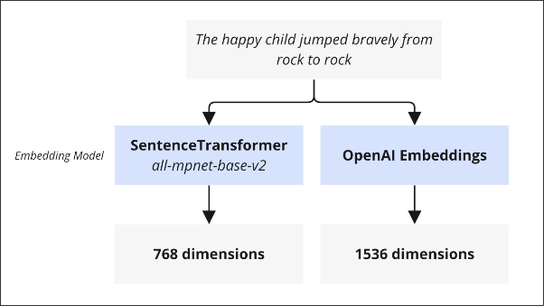

# Generating Embeddings

After [[2025-01-28_Chunking-Text|Chunking Text]], we want to turn the chunks into embeddings.

There are two main ways to generate embeddings:



1. **SentenceTransformer**:
it can use different algorithms to generate embeddings, it'll do the job in your computer.

2. **OpenAI Embeddings**:
It uses remote servers to generate embeddings, it's more powerful but you need to pay for it.

It should be noted that using different embedding models or algorithms will result in incompatible embeddings, even if the number of dimensions is the same and cannot be directly compared.

```py
from langchain_openai import OpenAIEmbeddings

embeddings = OpenAIEmbeddings(model="text-embedding-3-large")

embedding = embeddings.embed_query('Hello, world!')

print(embedding)
```

Let's run the code above to check the result embedding:

```sh
$ python main.py

[-0.005836049560457468, -0.024072736501693726, -0.022011131048202515, 0.02759141
6612267494, -0.0027998313307762146, -0.020507553592324257, -0.002683575265109539
, 0.05329173803329468, 0.02506478689610958, 0.023793721571564674, -0.00406895903
8704634, 0.01748489774763584, 0.0032202904112637043, -0.004665739368647337, -0.0
02699076198041439, 0.033574722707271576, -0.03304769843816757, 0.016167329624295
235, 0.0019075666787102818, -0.029684023931622505, 0.03042806312441826, -0.00902

# ... there are totally 1536 dimensions

```

But in reality, we will not manually use `.embed_query()` in this way. We will use embeddings in conjunction with vector storage, which will be introduced in the next topic.
