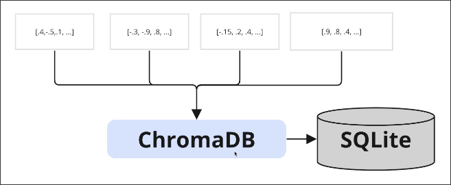

# Introducing ChromaDB

In [[2025-01-28_Generating-Embeddings|Generating Embeddings]], we learned how to generate embeddings from chunks of text. In this post, we will introduce ChromaDB to store and query these embeddings.


The core of ChromaDB is SQLite, supplemented with some math libraries to calculate similarity.

With ChromaDB, we don't need to compute embeddings manaually every time:

```sh
pip install langchain-chroma # langchain has a wrapper for ChromaDB for it to better integrate with the rest of the ecosystem
```

```python
from langchain_community.document_loaders import TextLoader
from langchain_text_splitters import RecursiveCharacterTextSplitter
from langchain_openai import OpenAIEmbeddings
from langchain_chroma import Chroma # ChromaDB wrapper

loader = TextLoader("facts.txt")
text_splitter_recursive = RecursiveCharacterTextSplitter(
    chunk_size=100,
    chunk_overlap=20
)
embeddings = OpenAIEmbeddings(model="text-embedding-3-large")

documents = loader.load()

docs = text_splitter_recursive.split_documents(documents)

# Create a ChromaDB instance with the documents and embeddings
db = Chroma.from_documents(
    # directly pass the documents and embeddings, and ChromaDB will automatically generate embeddings by itself
    docs,
    embeddings,
    # create a SQLite database (a directory) to store the embeddings persistently
    persist_directory="emb"
)

# With the instance of ChromaDB, we can now find the most similar documents to a query with score
results = db.similarity_search_with_score("Tell me an interesting fact about the English language.")

print(results)
```

Let's run the code above and see what we get:

```sh
 python main.py
[
  (
    # Document object stored in the database
    Document(
      id='91e0d284-fc8b-44a8-987a-8d561111e588',
      metadata={'source': 'facts.txt'},
      page_content="5. The longest word in the English language is 'pneumonoultramicroscopicsilicovolcanoconiosis.'"
    ),
    1.360613226890564 # similarity score, the lower the better
  ),
  (
    Document(
      id='5967c91d-852d-4efd-864b-491f18c4427a',
      metadata={'source': 'facts.txt'},
      page_content='1. "Dreamt" is the only English word that ends with the letters "mt."'
    ),
    1.37629234790802
  ),
  (
    Document(
      id='13358788-76a2-4573-ade9-6af7c3ac20be',
      metadata={'source': 'facts.txt'},
      page_content="87. The dot over an 'i' or 'j' is called a tittle.\n88. A group of owls is called a parliament."
    ),
    1.3914647102355957
  ),
  (
    Document(
      id='2e9b54cb-e763-4395-b2f2-873d97d5baa0',
      metadata={'source': 'facts.txt'},
      page_content='90. The modern Italian language originated from the region of Tuscany.'
    ),
    1.417928695678711
  )
]
```

You can see that by default, four most relevant documents are listed, along with their similarity scores.

If scores are not needed, you can use the `similarity_search` method, or you can use the argument `k=` to specify the number of Documents to return.

```python
results = db.similarity_search(
    "Tell me an interesting fact about the English language.",
    k=2
)
```

```sh
 python main.py
[
  Document(
    id='5a03bce0-e016-4178-91eb-579a0fd7adbe',
    metadata={'source': 'facts.txt'},
    page_content="5. The longest word in the English language is 'pneumonoultramicroscopicsilicovolcanoconiosis.'"
  ),
  Document(
    id='91e0d284-fc8b-44a8-987a-8d561111e588',
    metadata={'source': 'facts.txt'},
    page_content="5. The longest word in the English language is 'pneumonoultramicroscopicsilicovolcanoconiosis.'" # same content as the first Document
  )
]
```

Although our needs have been met, you may notice that the Documents are duplicated. This is because each time the program runs, it inserts the documents into ChromaDB again, causing duplicate data to be stored in the database, resulting in the above outcome.

We'll address this issue in the next post.


