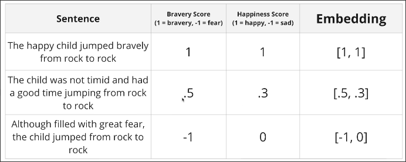
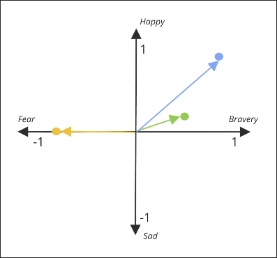

# Introducing Embeddings

In [[2025-01-28_Search-Criteria|Search Criteria]], we used word matching to determine the user input and each fact but it's very rough. This topic, we'll use an alternative method called `semantic search` which is implemented by `embeddings`.

We analyze the user input and each fact in different quantities, each quantity value is from -1 to 1.

Then, we treat each quantity as a dimension and represent the user input and each fact as a point in a multi-dimensional space.

There are two methods to determine the correlation between two points:

1. **Squared L2**: distance between two points
2. **Cosine Similarity**: angle between two points, even two points are far away, they can be similar if they are in the same direction, which means they are both talking about the same thing.

