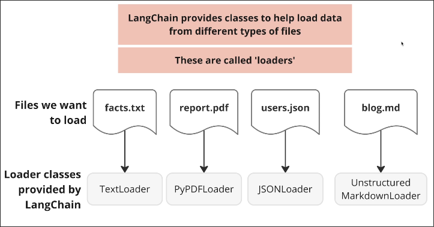
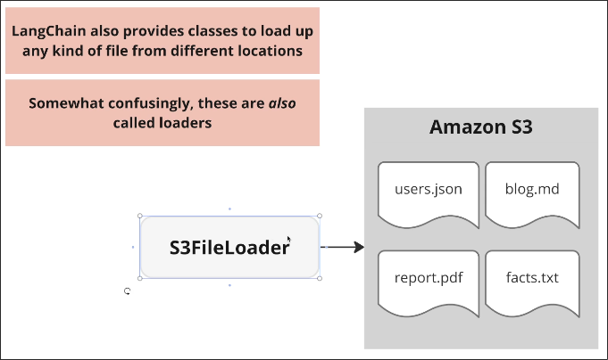
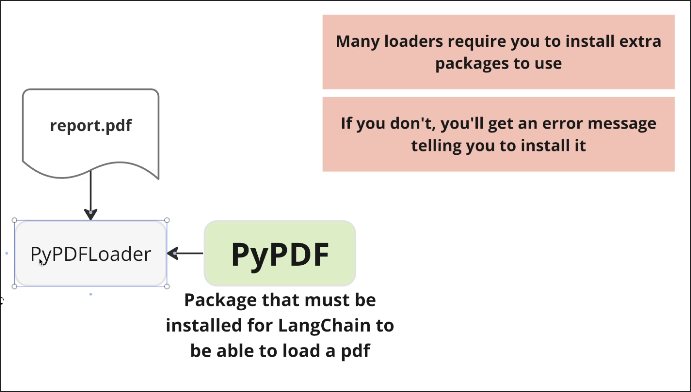
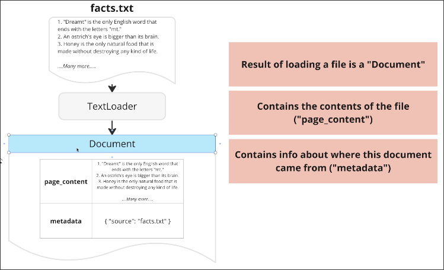

# Loading Files with Document Loaders

LangChain provides many types of loader classes that allow us to load files in different formats, such as CSV, JSON, XML, Excel, and so on.



LangChain even provides loaders that can load data from different locations, such as S3FileLoader.



This `S3FileLoader` can load files in different formats as above, so it is slightly different from the loaders introduced earlier for different local file types.

Many loaders require some additional packages for support, we can install these packages through error messages.


The output of loaders will be a list of Document, Document is also a class, containing two fields as shown in the diagram below:




Let's try to use the `TextFileLoader` to load a text file.

Write the following code in a Python file:

```python
from langchain_community.document_loaders import TextLoader

loader = TextLoader("facts.txt")
documents = loader.load()

print(documents)
```
Then, run the Python file. You will see the output as below:

```sh
$ python main.py

[
  Document(
    metadata={'source': 'facts.txt'},
    page_content='1. "Dreamt" is the only English word that ends with the letters "mt."\n2. An ostrichs eye is bigger ... blood flowing.'
  )
]
```


